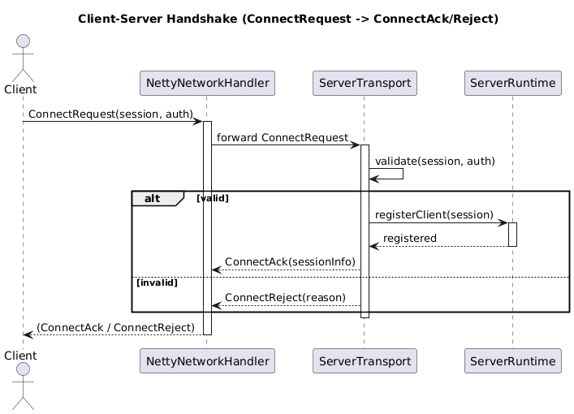
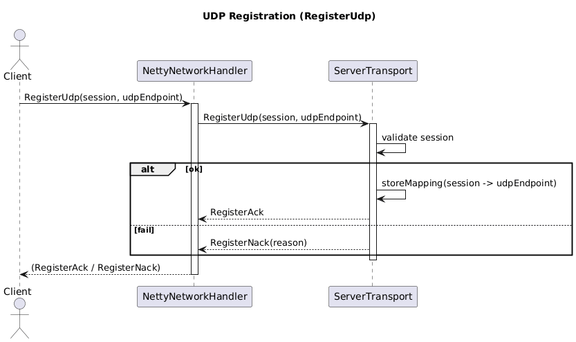
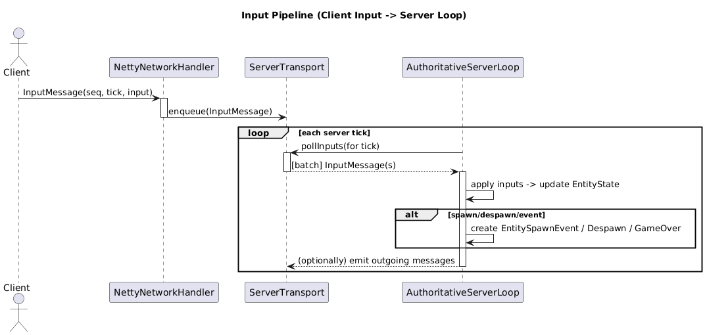
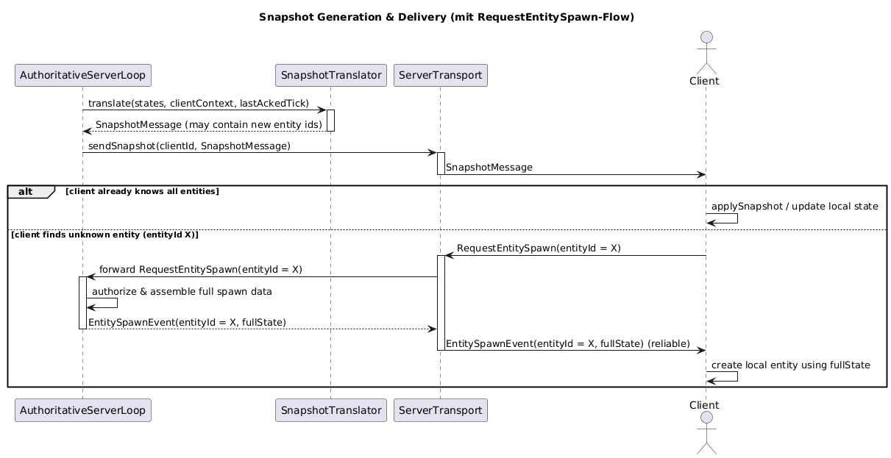
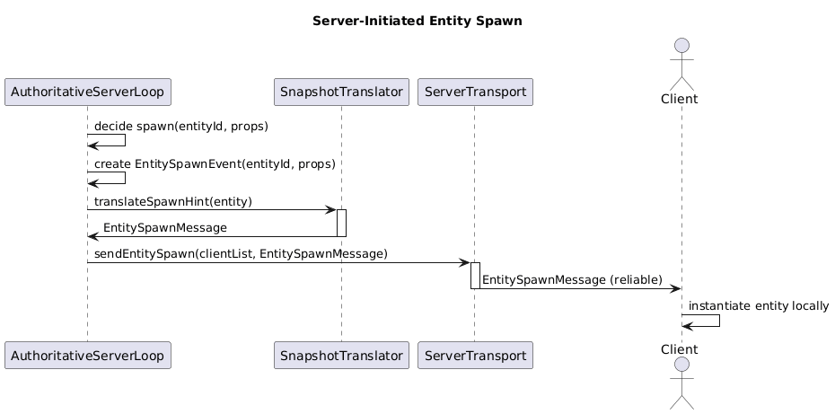
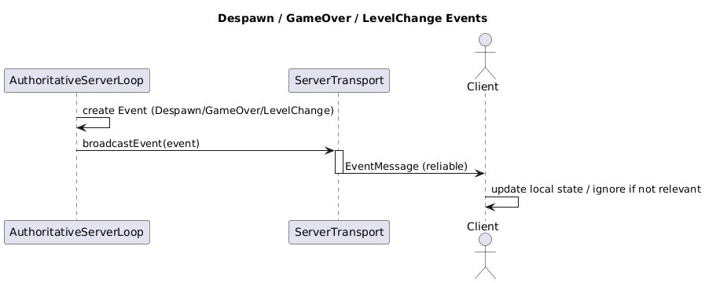
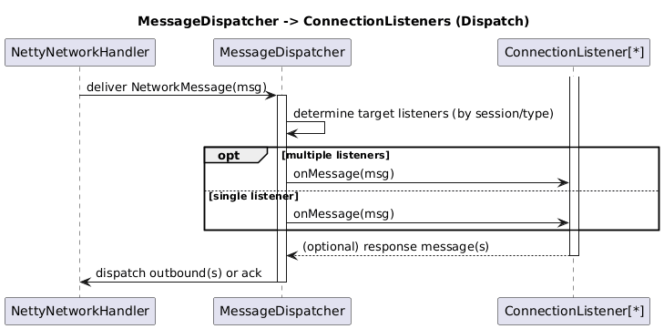
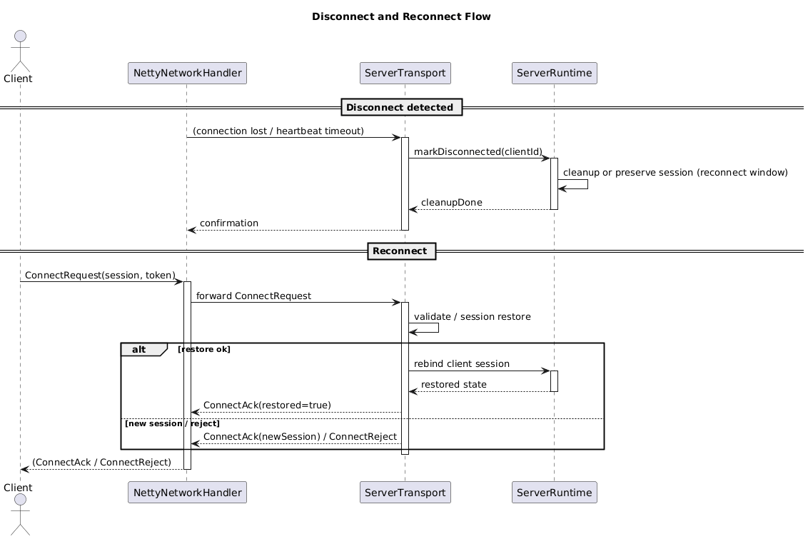

# Technische Analyse: Multiplayer

Version: 1.0.0
Datum: 22.09.2025  

## Executive Summary

Ziel: Echtzeit-Multiplayer für bis zu 6 Spieler pro Sitzung mit server-autoritativer Architektur. Der Server läuft mit 30 Hz. Implementierung in Java 21 / LibGDX mit Netty, TCP-first und optionalem UDP-Fast-Path. Sitzungen sind ephemer und der Server ist initial headless, die Architektur ist modular für spätere Erweiterungen.

Unmittelbare Konsequenzen: strikte Trennung von Client- und Serverlogik, ein ECS-basiertes Replikationsschema, eine Transport-Abstraktion (reliable vs. unreliable) über Netty und eine Lokale-Server-Option für einfacheres Debugging/Singleplayer-Kompatibilität.

Testing-Kurzfokus: Netzwerkemulation (Latenz/Jitter/Loss) in lokalem Testing und CI, deterministische fixed-timestep Server-Ticks, State-Capture/Replay sowie spezifische Multiplayer-Tests, da bestimmte Pfade nur im Multiplayer verfügbar sind.

## 1. Einleitung

Dieses Dokument definiert das Multiplayer-Konzept des ECS-Dungeon-Frameworks und schafft eine einheitliche, nachvollziehbare Grundlage für Entwurf, Implementierung und Prüfung. Es richtet sich an neue und bestehende Entwickler im Team, die eine präzise Referenz für Architektur und Protokolle benötigen, sowie an Projektleitung, die Designentscheidungen und deren Implikationen nachverfolgen will.

Zweck des Dokuments ist die klare, versionierbare Spezifikation der Multiplayer-Architektur von der Protokollebene bis zum Laufzeitverhalten. Es stellt sicher, dass Entscheidungen (z. B. Transportwahl, Replikationsschema) und deren Konsequenzen für Implementierung und Test reproduzierbar sind und in allen Subprojekten, die auf dem Dungeon-Framework aufsetzen, konsistent angewandt werden.

Geltungsbereich:
- Abgedeckt: Architekturauswahl (inkl. Schichtentrennung Client/Server), Protokolldesign und DTO-Spezifikationen, Transportmechanismen und deren Abstraktion, Laufzeitverhalten (Ticking, Replikation, Jitter-Toleranz), Fehlerbehandlung und Resilienz, Test- und Debug-Strategien, sowie Erweiterbarkeits- und Modularitätsaspekte.
- Nicht abgedeckt: Matchmaking und Hosting/Deployment. Diese sind im aktuellen, kontrollierten Einsatzkontext nicht relevant und werden nur insoweit berührt, wie sie Schnittstellenanforderungen an die Architektur implizieren.

## 2. Designentscheidungen

### 2.1 Server-autoritativer Ansatz (statt P2P/Lockstep)
Wir verwenden einen server-autoritativen Aufbau: Der Server simuliert den Spielzustand im festen Takt (Ziel: 30 Hz), Clients senden ausschließlich Eingaben. Das erhöht Konsistenz, reduziert Cheat-Möglichkeiten und hält die Client-Logik schlank - insbesondere passend zu einer ECS-Architektur, in der der Server komponentenweise prüft und repliziert. Verworfen wurden:
- Peer-to-Peer: hohe Komplexität (NAT, Topologien, Host-Migration) und schwer zu härtende Vertrauensgrenzen.
- Deterministisches Lockstep: erfordert Bit-Determinismus und koppelt die wahrgenommene Latenz an den langsamsten Teilnehmer für action-orientierte ECS-Titel unvorteilhaft.
  Diese Wahl entspricht etablierten Industriemustern und Erfahrungsberichten zu Echtzeitspielen [1], [4;5;6].

### 2.2 Snapshot-basierte Synchronisation (statt Event- oder reinen State-Diff-Protokollen)
Der Server erzeugt periodische Zustands-Snapshots relevanter ECS-Daten und übermittelt sie den Clients. Die Clients puffern kurz und interpolieren zwischen zwei bekannten Zuständen der eigene Hero kann (optional) lokal vorhergesagt und beim nächsten Snapshot korrigiert werden. Gründe:
- Robustheit und Debugbarkeit: Snapshots bilden eine kanonische Wahrheit ab (Late-Join ist einfach, da verlorene Zustände vom nächsten Snapshot abdeckt werden).
- Erweiterbarkeit: Replikationsregeln lassen sich komponentenbasiert deklarieren so bleiben interne Datenstrukturen gekapselt.
- Effizienzperspektive: Mit Delta/Baseline-Kompression (Roadmap) wird Bandbreite weiter reduziert.
  Alternativen wurden verworfen, da Event-Ströme Ordnungs-/Kausalitätskomplexität erhöhen und reine Diffs baseline-sensitiv sind. Der Snapshot-Interpolationsansatz ist in Industriequellen umfassend beschrieben [2;3;6;7].

### 2.3 Transport: TCP-first mit UDP für Eingaben
Wir verfolgen einen pragmatischen Hybrid:
- TCP für Snapshots und wichtige Steuer-/Metadaten (Zuverlässigkeit, Geordnet und geringerer Implementierungsaufwand im MVP).
- UDP für zeitkritische Eingaben (InputMessage), da diese häufig und kurzlebig sind.

Kurz erklärt:
- **TCP** garantiert Reihenfolge und Verlustfreiheit, kann jedoch Head-of-Line-Blocking (HoL) verursachen: Geht ein früheres Segment verloren, werden nachfolgende Daten bis zur erfolgreichen Neuzustellung zurückgehalten - die Latenz für Echtzeit-Daten steigt [8].
- **UDP** liefert ohne Garantie für Zustellung/Reihenfolge. Einzelne verlorene Eingaben sind akzeptabel, da neue Eingaben die alten semantisch überholen [9].

Begründung:
- MVP-Vorteil: Snapshots über TCP ersparen einen eigenen Zuverlässigkeits-/Staukontroll-Layer. Bei ≤6 Spielern und kompakten Frames bleibt das HoL-Risiko beherrschbar (Framing, kleine Nachrichten, Priorisierung, `TCP_NODELAY`).
- Reaktionsfähigkeit: Eingaben über UDP vermeiden Blockaden durch TCP-Retransmits und verpasste Inputs werden durch nachfolgende ersetzt.
- Evolutionspfad: Die API trennt "reliable" vs. "unreliable", sodass spätere Auslagerungen (z. B. Snapshot-Deltas via UDP) möglich bleiben. Dieses Modell deckt sich mit gängigen Empfehlungen aus Praxisartikeln [1;2;3].

### 2.4 Zentrale "Network API" über `Game.network()`
Eine gemeinsame Schnittstelle (`INetworkHandler`, nutzbar via `Game.network()`) stellt konsistente Aufrufe für Singleplayer (lokal) und Multiplayer (remote) bereit und vermeidet Code-Duplikate.
- Semantik ist explizit: `send(..., reliable)` wählt zuverlässig vs. unzuverlässig. `sendInput(...)` standardisiert den Eingabekanal. `pollAndDispatch()` entkoppelt IO-Threads vom Game-Loop für deterministische Verarbeitung.
- Austauschbarkeit: Implementierungen (lokal, TCP-first, TCP+UDP) lassen sich per Factory/DI wechseln, ohne Spielcode zu verändern. Das reduziert Testsaufwand und fördert Modularität (Ports-und-Adapter-Prinzip).

### 2.5 Technologieauswahl: Netty und Protobuf (mit temporärer Java-Serialisierung)
- Netty: ausgereifter JVM-Netzwerk-Stack mit effizientem Framing, Backpressure und breiter Protokollunterstützung (TCP/UDP). Es ist auch weit verbreitet und gut dokumentiert [10].
- Protobuf (Zielzustand): schlanke, versionierbare Binärserialisierung mit stabilem Ökosystem. Erleichtert Schema-Evolution und Kompatibilitätstests [11]. Es ist auch sicherer als die native Java-Serialisierung [12;14].
- Kompromiss im MVP: Vorläufig Java-Objektserialisierung, da wir in einen kontrollierten Umfeld sind, zur Reduktion der Implementierungszeit mit geplantem Migrationspfad zu Protobuf. Hinweis: Untrusted-Deserialization birgt bekannte Sicherheitsrisiken und sollte perspektivisch vermieden/hart abgesichert werden [12;14].
- Alternativen: JSON ist zu groß/langsam für Echtzeit-Multiplayer. Kryo/KryoNet bieten auch eine gute API und Performance, wird aber aktuell nicht mehr aktiv gepflegt [13].

## 3. Anforderungen

Dieser Abschnitt spezifiziert Muss- und Kann-Anforderungen sowie nicht-funktionale Kriterien. Wertzahlen sind Zielgrößen und werden in Tests verifiziert. Zur besseren Verständlichkeit werden zentrale Netzwerkkonzepte kurz erklärt.

### 3.1 Funktionale Anforderungen

Must
- Autoritativer Server
    - Der Server simuliert den kanonischen Spielzustand. Clients senden ausschließlich Eingaben.
    - Begriff: Autorität = einzig gültige Quelle der Wahrheit (Servervalidierung verhindert divergierende Clientzustände) [1], [6].
- Snapshot-basierte Synchronisation (über TCP)
    - Periodische Zustands-Snapshots des relevanten ECS-Subsets vom Server an die Clients. Snapshots werden zuverlässig und in Reihenfolge über TCP übertragen.
    - Client hält einen kurzen Interpolationspuffer (konfigurierbar, Zielbereich bis max. 100 ms).
    - Begriffe:
        - Snapshot = kompaktes Abbild ausgewählter Entity-Zustände zu einem Server-Tick [2], [6].
        - Interpolationspuffer = kleine Zeitreserve, um ungleichmäßig eintreffende Updates zu glätten. Es reduziert sichtbares Ruckeln bei geringem Anzeige-Lag [3], [6].
- DTO-basierte Protokolle
    - Dedizierte, versionierte DTOs für: Handshake (Connect/Accept), Verbindungsmanagement (Keepalive/Disconnect), PlayerInput, Snapshot, EntitySpawn/Despawn, LevelChange.
    - Jedes DTO trägt mindestens: protocolVersion, messageType, optional schemaVersion (für Schema-Evolution/Migration).
- Verbindungsmanagement
    - Connect/Disconnect inkl. Fehlerpfade; Heartbeats/Keepalives; definierter Timeout für als "verloren" zu betrachtende Clients; serverseitiges Aufräumen.
    - Reconnect-Fenster: Der zugehörige "Hero" bleibt beim kurzzeitigen Verbindungsabbruch bestehen und kann vom gleichen Client wieder übernommen werden.
    - Begriffe:
        - Heartbeat/Keepalive = kleines, periodisches Lebenszeichen zur Ausfall-Detektion [8], [9].
        - Timeout = Inaktivitätsgrenze, nach der eine Verbindung als getrennt gilt.
- Client-seitige Interpolation
    - Fremde Entitäten werden zwischen zwei bekannten Zuständen interpoliert; Rendering ist gegenüber der Server-Tickrate entkoppelt [3], [6].

Optional
- UDP-Unterstützung
    - Inputs (C→S) über UDP (unreliable, sequenziert) für geringe Latenz. Später optional: Snapshots (S→C) über UDP mit Baseline/Deltas und selektiver Zuverlässigkeit.
    - Begriffe:
        - UDP unreliable = keine Zustell-/Reihenfolgegarantie; neuere Inputs überholen ältere semantisch [9], [1].
        - Sequenziert = Anwendung vergibt fortlaufende Nummern, um veraltete Pakete zu verwerfen.
- Deltas/Baselines für Snapshots
    - Zustandsübertragung als Delta gegenüber bestätigter Baseline; Acks/Reseeding bei Verlust.
    - Begriffe:
        - Baseline = zuletzt bestätigter Referenz-Snapshot pro Client.
        - Delta = nur Änderungen relativ zur Baseline; spart Bandbreite [2].
- Late Join
    - Beitritt nach Spielstart durch initialen Zustandssnapshot plus Warm-Up-Interpolation.
- Client-Side Prediction und Server Reconciliation
    - Vorhersage lokaler Steuerung mit sanfter Korrektur nach Server-Snapshot [1], [6].
- Server-seitige Eingabevalidierung
    - Plausibilitätsgrenzen (z. B. Rate Limits) als Anti-Cheat-Grundschutz [5].
- Voice Chat
    - Z. B. über WebRTC/externen Dienst; nicht Teil der Spielprotokolle.
- LocalNetworkHandler
    - Embedded/Local Server-Modus über dieselbe `Game.network()`-API für Singleplayer/Debugging.

### 3.2 Nicht-funktionale Anforderungen

Latenz und Qualität
- Ziel-SLO: p95 Roundtrip "Input→Snapshot" < 100 ms.
    - Begriffe:
        - p95 = 95-Perzentil: 95 % aller Messungen liegen unterhalb des Grenzwerts; robust gegenüber Ausreißern.
        - Roundtrip "Input→Snapshot" = Zeit vom Absenden einer Eingabe bis zum Empfang eines Snapshots, der die Wirkung dieser Eingabe enthält.
        - RTT (Round-Trip Time) = Hin- und Rückwegzeit einer Nachricht; beeinflusst Interaktivität [6], [7].
        - Jitter = Schwankung der Verzögerung; wird durch Pufferung/Interpolation gemildert [17].
- Annahmen für Netzbedingungen (Testprofile)
    - Paketverlust bis 1-2 % (einseitig), Jitter bis 50 ms (one-way), typische RTT 40-80 ms.
    - Interpolationspuffer: konfigurierbar; Zielbereich 66-100 ms (Feintuning anhand Messungen).
- Tick-/Snapshot-Raten
    - Server-Tickrate: Ziel 30 Hz (33,3 ms), konfigurierbar.
    - Snapshot-Rate: initial 30 Hz; entkoppelbar von der Tickrate (z. B. 20-30 Hz), konfigurierbar.
    - Begriff: Tick = fester Simulationsschritt des Servers; Snapshot-Rate kann gleich oder niedriger sein.

Skalierung und Betriebsmodell
- Sitzung/Prozess
    - Ein Server-Prozess hostet genau eine Sitzung/Match ("Single-Match-Server").
    - Maximale Spielerzahl: Standard 6, konfigurierbar.
- Ressourcenbudget
    - Der Simulationsschritt (inkl. Eingaben anwenden) soll im Median ≤ 8 ms pro Tick bleiben (Budget für IO/Jitter).

Testbarkeit
- Lokale Simulation
    - Embedded/Local Server-Modus über dieselbe `Game.network()`-API.
- Unit/Contract-Tests
    - DTO-Roundtrip (Serialize/Deserialize), Versionierung/Abwärtskompatibilität, Message-Dispatcher-Routen.
- Netzwerkemulation
    - Reproduzierbare Tests mit injizierter Latenz/Jitter/Verlust (Netty-Handler).
- Soak/Resilienz-Tests
    - Längere Läufe mit Burst-Loss/Spike-Latenzen; Metriken: RTT, Jitter, Loss, Tick-Zeit, Pufferfüllstand.
    - Begriff: Soak-Test = Langzeittest zur Erkennung von Lecks/Drift/Robustheitsproblemen.

Einfachheit und Modularität
- Schichtentrennung
    - Klare Trennung von Client-Rendering/UI, Client-Netcode (Interpolation, optional Prediction) und Server-Simulation/Autorität.
- Zentrale API
    - Einheitliche Schnittstelle (`Game.network()`/`INetworkHandler`) für Singleplayer und Multiplayer; Austauschbarkeit der Implementierungen (lokal, TCP+UDP).
- Konfigurierbarkeit
    - Tick/Snapshot-Raten, Interpolationspuffer, Limits (MTU, maximale Nachrichtengröße), Timeouts als Konfigurationen.
    - Begriff: MTU (Maximum Transmission Unit) = maximale Paketgröße ohne Fragmentierung; zu große UDP-Pakete riskieren Fragmentverlust [16].

Sicherheit und Betrieb
- Minimalhärtung
    - Größenlimits (z. B. max. TCP-Frame), Typprüfung/Validierung von DTO-Feldern, Rate Limits für Inputs.
- Serialisierung
    - MVP: Java-Serialisierung zulässig (kontrolliertes Umfeld); mittelfristig Migration auf Protobuf. Untrusted-Deserialization vermeiden/absichern [12].
- NAT/Erreichbarkeit
    - Annahme: Server besitzt erreichbares TCP/UDP-Endpoint (öffentliche Adresse/Port-Forward); keine P2P-Hole-Punching-Verfahren nötig.
    - UDP-Pfad wird durch initiale "Registrierung" (kurze Client-Pakete an den Server) etabliert; regelmäßige Inputs halten die NAT-Zuordnung ("Binding") aktiv [12].

### 3.3 Verbindungs- und Reconnect-Semantik

Keepalive/Timeout
- Heartbeat-Intervall: 2 s (TCP), geringe Payload. Bei UDP-Inputs entfällt separater UDP-Heartbeat, solange Input-Pakete regelmäßig eintreffen.
- Disconnect-Erkennung: Timeout = 10 s ohne jegliche Lebenszeichen (kein TCP-Heartbeat/Traffic und keine UDP-Inputs).

Reconnect
- Reconnect-Fenster: 60 s nach Disconnect bleibt der "Hero" bestehen und wird nicht despawned.
- Wiederaufnahme
    - Client präsentiert beim Reconnect seine letzte clientId plus ein vom Server beim Connect vergebenes sessionToken; bei Übereinstimmung wird dieselbe Entity wieder zugewiesen.
    - Nach 60 s Inaktivität: automatische Freigabe/Despawn.
- Verhalten im Fenster
    - Entity bleibt passiv/neutral (keine Eingaben) oder erhält minimale Idle-Logik; keine garantierte Unverwundbarkeit. Alternativ: Sitzung pausieren, bis Reconnect/Timeout.

### 3.4 Mess- und Abnahmekriterien

- Latenz-SLO
    - In einem Testprofil mit 60 ms RTT, 1 % Loss, 30 ms Jitter (one-way) erreicht der Roundtrip Input→Snapshot p95 < 100 ms über einen 30-min Soak-Test.
- Robustheit bei Verlust
    - Bei 2 % einseitigem Paketverlust bleiben sichtbare Positionssprünge ≤ 1 Ereignis/Minute bei Interpolationspuffer 66-100 ms (Heuristik).
- Reconnect
    - Verbindungsabbruch führt nicht zum sofortigen Despawn; innerhalb 60 s kann der Client mit identischer Kennung/Token fortsetzen.
- DTO-Kompatibilität
    - Änderungen an internen ECS-Strukturen erfordern keine Protokolländerung, solange DTO-Schema stabil bleibt; Tests belegen Abwärtskompatibilität zwischen aufeinanderfolgenden Schema-Versionen.

### 3.5 Klarstellungen/Abgrenzungen

- Nur eine Sitzung pro Server-Prozess; horizontale Skalierung über mehrere Prozesse/Instanzen.
- MVP-Transportpfad
    - Snapshots und Steuer-/Metadaten über TCP (reliable, in-order).
    - Inputs über UDP (unreliable, sequenziert).
    - Später: optionale Snapshot-Deltas über UDP.
- Keine P2P-Verbindungen, kein NAT-Hole-Punching; alle Verbindungen sind client-initiierte Outbound-Verbindungen auf einen bekannten Server-Endpoint.
- Sicherheit heute "best effort" (kontrolliertes Umfeld); spätere Härtung (Protobuf, umfassendere Validierung) ohne Architekturbruch möglich.

Hinweis zur Terminologie (Kurzüberblick)
- p95 = 95-Perzentil; robustes Zielmaß für Latenz-SLOs.
- RTT = Round-Trip Time; Hin- und Rückwegzeit.
- Jitter = Schwankung der Verzögerung.
- Tick = fester Simulationsschritt des Servers; Snapshot = übertragener Zustand; Interpolationspuffer glättet Jitter.
- UDP "unreliable"/"sequenziert" = keine Transportgarantien; Reihenfolge wird bei Bedarf in der Anwendung durch Sequenznummern bewertet.
- MTU = maximale Größe eines nicht fragmentierten Pakets.

## 4. Architekturübersicht

Dieses Kapitel beschreibt die Hauptkomponenten, ihre Verantwortlichkeiten und die zentralen Datenflüsse vom Verbindungsaufbau bis zur Zustellung der Zustände. Ziel ist eine klare, testbare Trennung von Transport, Protokoll, Server-Simulation und Client-Laufzeit.

### 4.1 Hauptkomponenten und Verantwortlichkeiten

- Transport
    - Aufgabe: Netzwerkkommunikation über TCP (reliable, in-order) und optional UDP (unreliable, sequenziert) bereitstellen; Framing, Backpressure und Limits umsetzen.
    - Implementierungen: Netty-basierter Client/Server-Transport; für UDP separater Endpunkt mit Registrierungs-Flow.
    - Invarianten: Keine Spiel-/Simulationslogik in IO-Threads; vollständige Deserialisierung und sichere Übergabe an Queues.

- Dispatcher
    - Aufgabe: Eingehende Nachrichten deterministisch auf dem Game-Thread an registrierte Listener/Handler zustellen; Routing nach Sitzung/Nachrichtentyp.
    - Invarianten: Callbacks werden ausschließlich auf dem Game-Thread ausgeführt (keine Nebenläufigkeit in Spielcode); Reihenfolge pro Verbindung bleibt erhalten.

- Translator
    - Aufgabe: Abbildung zwischen Spielzustand/Components und Netzwerk-DTOs.
    - Bestandteile:
        - SnapshotTranslator: Erzeugt aus dem ECS pro Tick vollständige Snapshots (heute) bzw. später Deltas/Baselines; wendet eingehende Snapshots auf den Clientzustand an.
        - NetworkCodec: Serialisiert/Deserialisiert DTOs (MVP: Java-Serialisierung; Ziel: Protobuf), inkl. Versionierung und Größenlimits.

- Server Loop (AuthoritativeServerLoop)
    - Aufgabe: Autoritative Simulation bei fester Tickrate (Ziel 30 Hz); Anwenden der Input-Queue; Erzeugen und Versenden von Snapshots; Emission zuverlässiger Spiel-Events (Spawn/Despawn/LevelChange).
    - Invarianten: Fester Zeitschritt; deterministische Ausführung pro Tick; keine Blockaden durch IO.

- Client Runtime
    - Aufgabe: Handshake, optionale UDP-Registrierung, Senden von Inputs (UDP), Empfang von Snapshots (heute TCP), Interpolation/Buffering und Zustandsanwendung; Reconnect-Wiederaufnahme.
    - Invarianten: Rendering von fremden Entitäten aus Interpolationspuffer; lokaler Zustand nur über autoritative Snapshots korrigiert.

- Zentrale API
    - Zugriff über `Game.network()` (INetworkHandler): Einheitliche Aufrufe für Singleplayer (lokal/embedded) und Multiplayer (remote). Semantik: `send(..., reliable)`, `sendInput(...)`, `pollAndDispatch()`, `messageDispatcher()`, `snapshotTranslator()`.

### 4.2 Grober Datenfluss (mit Sequenzdiagrammen)

- Verbindungsaufbau (Handshake)
    - Client stellt TCP-Verbindung her, sendet ConnectRequest(session, auth). Server validiert und antwortet mit ConnectAck (inkl. sessionInfo) oder ConnectReject.
    - Diagramm: 

- UDP-Registrierung
    - Nach erfolgreichem TCP-Handshake sendet der Client kurze RegisterUdp-Pakete. Der Server validiert die Sitzung und lernt die UDP-Quelladresse (NAT-Binding). Bei Erfolg: RegisterAck. Bei Fehler: RegisterNack.
    - Diagramm: 

- Eingabepipeline (Client → Server-Tick)
    - Client sendet `InputMessage(seq, tick, input)` über UDP; Transport legt in der Input-Queue ab. Pro Server-Tick werden Inputs gebatcht angewendet, dann folgt die ECS-Simulation.
    - Diagramm: 

- Snapshot-Erzeugung und -Zustellung
    - Nach dem Simulationsschritt generiert der Server per SnapshotTranslator einen vollständigen Snapshot der relevanten Entitäten und überträgt ihn heute zuverlässig über TCP; der Client puffert kurz und interpoliert.
    - Hinweis: Später können Snapshots als UDP-Deltas mit Baselines übertragen werden; das Protokoll ist dafür vorbereitet.
    - Diagramm: 

- Server-initiierte Ereignisse
    - Seltene, kritische Ereignisse (Spawn/Despawn/LevelChange/GameOver) werden als zuverlässige EventMessages versendet; Clients aktualisieren ihren Zustand entsprechend.
    - Diagramme:
        - 
        - 

- Dispatcher-Zustellung
    - Der Netty-Handler liefert vollständig deserialisierte NetworkMessages an den MessageDispatcher. Dieser bestimmt Ziel-Listener und ruft deren `onMessage` auf dem Game-Thread auf. Optionale Antworten werden wieder über den Transport versendet.
    - Diagramm: 

- Disconnect und Reconnect
    - Bei Heartbeat-Timeout markiert der Server die Sitzung als getrennt, behält den Hero während des Reconnect-Fensters (z. B. 60 s). Der Client kann per ConnectRequest(session, token) die Sitzung wieder übernehmen; ansonsten wird ein neuer Held erstellt oder er wird abgelehnt.
    - Diagramm: 

### 4.3 Threading- und Zuverlässigkeitsgrenzen

- IO-Threads vs. Game-Thread
    - IO-Threads (Netty) dürfen ausschließlich decodieren/encodieren und in Threadsichere Queues schreiben. Alle Spiel- und Dispatch-Operationen laufen auf dem Game-Thread via `pollAndDispatch()`. So bleiben Simulation und Eventverarbeitung deterministisch und gut testbar.

- Reliable vs. Unreliable Pfade
    - Heute: Snapshots und Steuer-/Event-Nachrichten über TCP (reliable, in-order). Inputs über UDP (unreliable, sequenziert durch Anwendungs-Sequenznummern).
    - Später: Optionale Snapshot-Deltas/Baselines über UDP, die API bleibt dann unverändert (reliable-Flag). Limits (z. B. maximale Framegröße, MTU) sind in `NetworkConfig` konfigurierbar.

### 4.4 Konfiguration

- Tick- und Snapshot-Raten (Standard 30 Hz, entkoppelbar), Interpolationspuffer (66-100 ms), Größenlimits (max. TCP-Frame), NAT-Registrierung (Retry-Policy), Heartbeat-Intervall und Timeouts, maximale Spielerzahl pro Instanz (Standard 6).

## 5. Protokoll & Nachrichtenmodell

Dieses Kapitel spezifiziert Kategorien, Semantik und Formate der Netzwerk-Nachrichten. Das Ziel ist ein versionierbares, testbares Protokoll mit klarer Trennung von zuverlässigen Steuer-/Event-Nachrichten und periodischen Zustandsaktualisierungen.

5.1 Kategorien und Semantik

- Commands/Events (zuverlässig)
    - Einmalige Aktionen oder diskrete Zustandsänderungen, die garantiert ankommen müssen und in Ordnung verarbeitet werden sollen, z. B. Handshake, Spawn/Despawn, Level-Wechsel, GameOver, Hero-Zuweisung, PlaySoundEvent.
    - Transport heute: TCP (reliable, in-order).
- Snapshot/EntityState (periodisch)
    - Regelmäßige Zustandsaktualisierungen, die den gegenwärtigen Spielzustand repräsentieren und auf dem Client interpoliert werden.
    - Transport heute: TCP (reliable). Perspektive: UDP-Deltas mit Baselines und selektiver Zuverlässigkeit.
- Input (zeitkritisch, kurzlebig)
    - Häufige, kleine Client→Server-Nachrichten, die verpasst werden dürfen (neuere Eingaben überholen ältere).
    - Transport: UDP (unreliable, sequenziert durch Anwendungs-Seq).

### 5.2 Serialisierung und DTO-Grundsätze

- Serialisierung
    - MVP: Java-Objektserialisierung (kontrolliertes Umfeld).
    - Zielzustand: Protobuf mit expliziten Schemas (Vorbereitung auf Abwärts-/Aufwärtskompatibilität).
- DTO-Design
    - Schlanke, zweckgebundene Datentransferobjekte (keine direkten ECS-Components).
    - Stabile Feldnamen und feste Typen; optionale Felder klar gekennzeichnet.
    - Versionierung über protocolVersion/schemaVersion im Header; evolutionäre Erweiterungen via optionale Felder statt Breaking Changes.

### 5.3 Nachrichtenheader und gemeinsame Felder

Gemeinsamer logischer Header (einige Felder nur für bestimmte Kategorien relevant):

- protocolVersion (short): Protokollversion der Verbindung.
- messageType (short): Enumerierter Typ der Nachricht (Routing).
- schemaVersion (short): Version des DTO-Schemas (für Migration).
- serverTick (int): Server-Ticknummer, wenn semantisch relevant (z. B. Snapshot, Event mit Sim-Bezug).
- seq (short): Sequenznummer für unzuverlässige Nachrichten (v. a. InputMessage, zur Ordnung/Verlusterkennung auf Anwendungsebene).
- sessionId/connNonce (int): Kurze Sitzungskennung für UDP-Nachrichten (Zuordnung nach RegisterUdp; optional bei TCP).
- flags (short): Bitmaske (z. B. reserved, compression, delta, baselineRefPresent).
- entityId (int): ID der betroffenen Entity (z. B. bei Spawn/Despawn/EntityState).

Hinweise:
- EntityId gehört nicht in jeden Header; sie ist Teil entity-spezifischer DTOs (Spawn, Despawn, EntityState).
- TCP stellt Reihenfolge/Zuverlässigkeit bereit; seq ist dort nicht nötig und wird nicht gesetzt.

### 5.4 DTO-Spezifikation

Hinweis: Die folgenden Strukturen sind Java-Records zur Veranschaulichung. In Protobuf werden sie als .proto-Dateien mit entsprechenden Feldtypen und Nummern definiert.

Client → Server

```java
public record ConnectRequest(
    int protocolVersion,
    String username,
    // optional (reconnect):
    int sessionId,
    byte[] sessionToken
) {}
```

```java
public record InputMessage(
    int clientTick,
    int seq,
    byte Action, // Move, Interact, Skill...
    // Optional (but may be need for some actions):
    Point location // where to move, where to shoot...
) {}
```

```java
public record RegisterUdp(
    int sessionId,
    short clientId,
    short nonce // gegen Replay/Verwechslung
) {}
```

```java
// Optional: if client references unknown entity
public record RequestEntitySpawn(
    int entityId,
    byte reason
) {}
```

```java
public record DisconnectNotice(
    byte reasonCode,
    String reasonText // Optional
) {}
```

Server → Client

```java
public record ConnectAck(
    int protocolVersion,
    short clientId,
    int sessionId,
    byte[] sessionToken
) {}
```

```java
public record ConnectReject(
    byte reasonCode,
    String reasonText // Optional
) {}
```

```java
public record EntitySpawnEvent(
    int entityId,
    // Client only need drawn Entities
    PositionComponent posComp, // contains Position, direction...
    DrawComponent drawComp // contains animation states and tranistions
) {}
```

```java
public record EntityDespawnEvent(
    int entityId,
    byte cause // died | left
) {}
```

```java
// To sync the local hero entity id with the remote one.
public record HeroSpawnEvent(
    int heroEntityId
) {}
```

```java
public record LevelChangeEvent(
    String levelName, // only to display
    String levelData // contains layout, spawnPos, ...
) {}
```

```java
public record GameOverEvent(
    byte reasonCode
) {}
```

```java
public record PlaySoundEvent(
    short soundId,
    Point pos,       // optional (positional)
    Float volume,  // optional
    short range // optional (0 for global)
) {}
```

```java
public record SnapshotMessage(
    int serverTick,
    List<EntityState> entities
) {}
```

```java
public record EntityState(
    int entityId,
    Point pos,
    // Optional:
    String viewDirection,
    Float rotation,
    Integer curHealth,
    Integer maxHealth,
    Float curMana,
    Float maxMana,
    String stateName,
    Integer tintColor
) {}
```

Antworten/Acks

```java
public record RegisterAck(
    boolean ok,
    // optional:
    Short serverUdpEcho, // Echo/Nonce
    Byte reasonCode
) {}
```

### 5.5 Transportabbildung (heutiger Stand)

- TCP (reliable, in-order)
    - ConnectRequest/ConnectAck/Reject
    - SnapshotMessage
    - EntitySpawnEvent / EntityDespawnEvent
    - HeroSpawnEvent, LevelChangeEvent, GameOverEvent
    - PlaySoundEvent (Default)
    - DisconnectNotice
- UDP (unreliable, sequenziert durch seq)
    - InputMessage
    - RegisterUdp / RegisterAck

### 5.6 Regeln für Versionierung, Deltas und Baselines

- Versionierung
    - Jede Nachricht trägt protocolVersion und messageType und optionale schemaVersion pro DTO ermöglicht evolutionäre Felder.
    - Server lehnt inkompatible ConnectRequests mit ConnectReject(incompatibleVersion) ab.
- Deltas (Roadmap)
    - SnapshotMessage kann alternativ Deltas gegenüber einer bestätigten Baseline enthalten.
    - Delta-Nachrichten tragen flags.delta=1 sowie baselineId: short und enthalten nur geänderte Felder. Clients, die die Baseline nicht kennen, fordern vollständige Zustände an oder erhalten periodische Full-Baselines.
- Baselines (Periodik)
    - Der Server sendet periodisch vollständige Baselines (z. B. alle N Sekunden oder alle M Snapshots), damit sich Fehler/Verluste nicht akkumulieren.
    - Der Client bestätigt empfangene Baselines implizit (bei TCP) oder explizit (bei UDP-Variante später) mit baselineAckId.
- Kompatibilität
    - Neue optionale Felder müssen Default-Werte besitzen und entfernte Felder bleiben bis zur nächsten Clientversion lesbar.
    - Für Protobuf: Felder niemals neu nummerieren, alte Felder als deprecated markieren.

### 5.7 Größenlimits und Framing

- TCP-Framing
    - Length-Prefixed Frames (Netty LengthFieldBasedFrameDecoder); maxTcpFrameBytes (z. B. 1 MiB) in NetworkConfig.
- UDP-Größen
    - maxUdpPayload ≈ 1200-1400 B (keine IP-Fragmentierung); InputMessage ist bewusst klein gehalten.
- Kompression (optional)
    - Für Snapshots: Bit-Flags und optionale Kompression (z. B. zlib)

### 5.8 Zuordnung zu den Diagrammen

- Handshake/Connect (Diagramm "Client-Server Handshake"): ConnectRequest/ConnectAck/Reject (TCP).
- UDP-Registrierung (Diagramm "RegisterUdp"): RegisterUdp/RegisterAck (UDP).
- Eingabepipeline (Diagramm "Input Pipeline"): InputMessage (UDP), Batch-Anwendung pro Tick.
- Snapshots (Diagramm "Snapshot Generation & Delivery"): SnapshotMessage (heute TCP, reliable).
- Server-Events (Diagramme "Server-Spawn", "Despawn/Level/GameOver"): zuverlässige Events (TCP).
- Dispatcher (Diagramm "MessageDispatcher"): messageType-basiertes Routing am Game-Thread.
- Disconnect/Reconnect (Diagramm "Disconnect and Reconnect Flow"): DisconnectNotice (optional), Reconnect über ConnectRequest(sessionId, sessionToken).

### 5.9 Hinweise zur Sicherheit (kontrolliertes Umfeld, aber zukunftsfähig)

- UDP-Inputs: sessionId/connNonce in Header aufnehmen sowie serverseitige Rate-Limits und Plausibilität überprüfen.
- Serialisierung: Java-Deserialization ausschließlich für vertrauenswürdige Clients -> Mittelfristig Migration auf Protobuf.
- Eingaben validieren: z. B. Bewegungsrate, Aktionsfrequenz.
- Replay/Injection: Bei späterem UDP-Snapshot-Betrieb Baseline-IDs/Nonces prüfen, um veraltete Pakete zu verwerfen.

## 6. Transport & Framing

Ziel dieses Kapitels ist ein latenzarmes, robustes Transport- und Framing-Design mit klaren Größenlimits, vorhersehbarem Backpressure-Verhalten und ohne IP-Fragmentierung bei UDP. TCP dient heute allen zuverlässigen Nachrichten (u. a. Snapshots, Events), UDP den zeitkritischen Inputs.

### 6.1 TCP-Framing und Limits

- Framing
  - Length-prefixed Frames mit 4-Byte-Längenfeld (Big-Endian) über Nettys LengthFieldBasedFrameDecoder/Prepender. Damit werden Applikationsnachrichten im TCP-Bytestrom eindeutig segmentiert [10].
  - Nagle deaktivieren (TCP_NODELAY = true), um Mikrolatenzen durch Bündelung zu vermeiden. Das Algorithmus-Verhalten und seine Nebenwirkungen sind in RFC 896 beschrieben [19].
  - Flush-Politik: pro Tick/Dispatch einmal flushen (Minimierung von Syscalls ohne zusätzliche Latenz).

- Größenlimits und Rationale
  - maxTcpFrameBytes: 1 MiB (konfigurierbar, NetworkConfig).
  - Begründung: TCP ist ein Bytestrom; OS/MSS-Segmentierung ist unabhängig von MTU [8]. Ein Anwendungs-Limit schützt vor Ausreißer-Frames (DoS-Risiko, lange Serialisierungszeiten) und reduziert "app-level HoL", wenn sehr große Frames den Game-Thread blockieren.
  - Richtwert: Snapshots deutlich unterhalb des Limits halten (z. B. 64-256 KiB bei 30 Hz). Größere Zustände sind zu quantisieren/komprimieren oder zu chunken (mehrere Frames, gleiche Tick-Anwendung).

- Backpressure
  - Empfangsverarbeitung strikt auf dem Game-Thread via pollAndDispatch() für den Determinismus.

### 6.2 UDP-Framing und Limits

- Paketgröße
  - maxUdpPayloadBytes: 1200 B. Dieser konservative Wert liegt unter typischen Path-MTUs (IPv4/IPv6) und vermeidet IP-Fragmentierung, was die Zustellsicherheit erhöht [9;15;18].

- Anwendungsheader
  - version (byte), messageType (byte)
  - sessionId oder connNonce (int), zur Zuordnung nach RegisterUdp
  - seq (short), zur Ordnung/Verlusterkennung auf Anwendungsebene
  - flags (byte), reserviert für künftige Modi (z. B. delta/baseline)

- Zuverlässigkeit/Ordnung
  - Keine Retransmits, keine Transport-Ordering. Inputs tragen seq die der Server nutzen kann für das Verwerfen von Duplikaten und veralteten Nachrichten. Neuere Eingaben überholen ältere.

### 6.3 Verbindungsmanagement

- TCP-Verbindung
  - Persistent, Heartbeat alle 2 s (kleines Keepalive). Timeout nach 10 s Inaktivität → Sitzung wird als getrennt markiert und verbleibt 60 s im Reconnect-Fenster (Entity bleibt erhalten). Reconnect mit ConnectRequest(sessionId, sessionToken).

- UDP-Pfad
  - Registrierung: Client sendet RegisterUdp(sessionId, clientId, nonce). Der Server validiert und speichert Mapping session → udpEndpoint. Dieses Verfahren entspricht üblichen NAT-Annahmen für ausgehende UDP-Flows [16].
  - Keepalive: Nur erforderlich, wenn temporär keine Inputs gesendet werden (z. B. Menüs/Pause). Dann z. B. alle 15 s ein kleines UDP-Keepalive. Bei aktiven Inputs entfällt es (Inputs halten das NAT-Binding frisch).
  - Nach Reconnect über TCP muss RegisterUdp wiederholt werden (NAT-Binding kann sich ändern).

### 6.4 Parameter

- TCP
  - lengthFieldSize: 4 B
  - maxTcpFrameBytes: 1_048_576
  - tcpNoDelay: true
  - writeFlushPolicy: "ein Flush pro Tick"
- UDP
  - maxUdpPayloadBytes: 1200
  - udpRegisterRetry: 3 Versuche, z. B. nach 100/200/400 ms
  - fallback: bei fehlendem UDP-Pfad weiter betrieblich funktionsfähig (TCP-only)
- Timeouts
  - heartbeatIntervalMs: 2000
  - disconnectTimeoutMs: 10000
  - reconnectWindowMs: 60000
- Puffer/Monitoring
  - OS-Standardpuffer als Start; Metriken (RTT, Jitter, Loss, Writability) beobachten und bei Bedarf moderat anpassen.

### 6.5 Ausblick

- UDP-Snapshots (später): Deltas gegenüber Baselines mit baselineId/flags.delta=1. Paketgröße ≤ 1200 B. Wenn ein Snapshot nicht in ein Paket passt, bevorzugt stärkere Quantisierung oder Priorisierung statt Fragmentierung. Nur falls unvermeidbar: applikationsseitiges Chunking mit Reassembly und partieller Verlusttoleranz.
- TCP-Chunking: Überschreitet ein Snapshot ein Softlimit (z. B. 256 KiB), in mehrere Frames aufteilen und am Client im selben Render-Fenster anwenden, um Frame-induzierte Lags zu vermeiden.

## 7. Serverlaufzeit & Simulation

Dieses Kapitel beschreibt die Ablaufsteuerung des autoritativen Servers vom Input-Eingang über die ECS-Simulation bis zur Snapshot-Erzeugung und -Zustellung. Ziel sind deterministische Ticks, klare Verantwortlichkeiten und eine stabile Versandpolicy für Zustandsupdates.

### 7.1 Tick-Pipeline (pro Server-Tick)

Der Server arbeitet deterministisch in einem Single-Thread-Loop mit fester Tickrate (Ziel: 30 Hz, beide Raten (Tick, Snapshotrate) sind entkoppelbar und konfigurierbar).

- Schritt 1: Client-Entity-Synchronisierung
    - Für neu verbundene Clients wird eine Spieler-Entity (Hero) erzeugt und zugeordnet. Beim Disconnect werden zurückgelassene Entities entfernt.
        - TODO: Reconnect-Fenster. Erlauben den Client zu reconencten zum den Helden wieder zu übernehmen.
    - Besonderheit: Die Hero-Entity wird erst nach erfolgreicher Zustellung von HeroSpawnEvent an den Client in die Simulation eingefügt (Vermeidung von Inkonsistenzen zum Client).
- Schritt 2: Input-Drain
    - Die UDP-Input-Queue wird vollständig geleert; Nachrichten werden in Empfangsreihenfolge angewandt. Der Server nutzt die transportseitig zugewiesene clientId, um den richtigen Avatar zu steuern.
    - Aktuell findet keine serverseitige Plausibilitätsprüfung statt (Anti-Cheat optional, vgl. Roadmap); Eingaben werden direkt in HeroController-Operationen übersetzt.
- Schritt 3: Simulation (ECS)
    - Alle registrierten Systems (u. a. Movement, Physics, AI, Collision, Health, Mana, etc.) laufen einmal im festen Zeitraster. Der Simulationsschritt ist deterministisch und blockiert nicht auf IO.
- Schritt 4: Tick-Zähler
    - Der serverTick wird monoton erhöht und mit Snapshots/Events mitgeführt, um Clients zeitlich zu referenzieren.

### 7.2 Snapshot-Erzeugung und Versandpolicy

Die Erzeugung und Zustellung von Zuständen ist entkoppelt vom Tick und läuft in fester Rate (Ziel: 30 Hz) auf demselben Server-Thread, sodass keine Nebenläufigkeit zwischen Tick und Snapshot besteht.

- Erzeugung
    - Nach dem Simulationsschritt erzeugt der SnapshotTranslator aus der autoritativen ECS-Welt pro Client einen vollständigen Snapshot (zukünftig optional Deltas/Baselines).
    - Jeder Snapshot trägt serverTick, damit der Client Interpolation/Buffering zeitlich einordnen kann.
- Sequenzierung
    - Da Snapshots aktuell über TCP laufen, ist eine Sequenznummer nicht erforderlich. Die Reihenfolge wird durch den Transport gewährleistet. Der serverTick dient der Konsistenzprüfung und zur Interpolation.
- Versandpolicy
    - Aktuell: Snapshots werden zuverlässig und in-order versendet (TCP). Dadurch ist kein eigener Reliability-Layer nötig verlorene Frames werden vom Transport nachgeliefert.
    - Später (Roadmap): Optionale UDP-Deltas mit Baselines, um Head-of-Line-Effekte zu vermeiden in diesem Modus definieren Delta-Flags und baselineId die Rekonstruktion.

### 7.3 Zeitsteuerung, Budget und Jitter

- Zeitsteuerung
    - Beide Raten (Tick und Snapshot) werden fixed-rate geplant. Da beide Tasks auf demselben Single-Thread-Executor laufen, kann kein gleichzeitiger Zugriff auf Spielzustand erfolgen. Scheduling-Jitter wird durch kurze, konstante Arbeit pro Tick minimiert.
- Budget
    - Ziel: Simulationsschritt (inkl. Input-Anwendung) ≤ 8 ms median bei 30 Hz, um Puffer für IO/GC zu lassen. Metriken (Tick-Zeit, Snapshot-Größe) müssen noch erhoben werden.
- Jitter und Wahrnehmung
    - Clients puffern Snapshots (66-100 ms) und interpolieren fremde Entitäten. Diese Technik glättet Jitter und decoupled Rendering von der Serverrate [3], [6], [20].

### 7.4 Threading- und IO-Grenzen

- Transport (Netty) deserialisiert vollständig in IO-Threads und schreibt in threadsichere Queues.
- Alle spielrelevanten Operationen (Input-Anwendung, ECS, Snapshot-Erzeugung, Event-Emission) laufen ausschließlich auf dem Server-Game-Thread. Damit bleiben Abläufe reproduzierbar und testbar.

### 7.5 Fehlertoleranz und Lifecycle

- Fehlerbehandlung
    - Tick- und Snapshot-Aufgaben sind in try/catch eingefasst. Ausnahmen werden geloggt, der Loop bleibt aktiv.
- Level-Lebenszyklus
    - Beim Abschluss aller Level wird ein GameOverEvent zuverlässig an alle Clients ausgesendet. Was die Clients sicher die Verbindung trennen lässt.

### 7.6 Konfiguration und Parameter

- Tick- und Snapshot-Raten aus Konfiguration (NetworkConfig), Standard 30 Hz / 30 Hz, entkoppelbar.
- Reliable-Pfad für Snapshots aktiv (TCP). Späterer Wechsel auf UDP-Deltas ohne API-Bruch möglich.
- Limits: maxTcpFrameBytes (z. B. 1 MiB), Ziel-Snapshotgröße deutlich darunter (64-256 KiB).
- TODO: Telemetrie: Messen p50/p95 Tick-Zeit, Snapshot-Bytes, Input-Rate, sowie Netzmetriken (RTT, Loss, Jitter).

## 8. Clientlaufzeit & Verarbeitung

Dieses Kapitel beschreibt den Laufzeitpfad des Clients vom Verbindungsaufbau bis zur Zustellung und Anwendung von Zustandsupdates. Der Client rendert, verarbeitet Eingaben, sendet Input-Nachrichten und übernimmt autoritative Zustände des Servers. Threading-Ziel: sämtliche Spiel-/ECS-Operationen laufen auf dem Game-Thread; IO bleibt strikt im Transport.

### 8.1 Start, Handshake und UDP-Registrierung

- Start/Bootstrap
    - Der Client initialisiert den Clientmodus (multiplayerEnabled=true, isNetworkServer=false), setzt Zieladresse/Port und startet die Game-Loop mit 30 FPS.
- TCP-Handshake
    - Nach erfolgreichem TCP-Connect sendet der Client ConnectRequest(username, optional sessionId/token).
    - Der Server antwortet mit ConnectAck(clientId, sessionId, sessionToken) oder ConnectReject(reason).
- UDP-Registrierung
    - Nach ConnectAck sendet der Client mehrere RegisterUdp-Pakete (kurzer Retry-Zyklus). Der Server bestätigt mit RegisterAck(ok/Reason) und lernt das session->udpEndpoint-Mapping.
    - Falls UDP nicht etabliert werden kann, bleibt der Client funktionsfähig (TCP-only), Inputs werden dann vorübergehend nicht über UDP verschickt (Roadmap/Fallback).

### 8.2 Eingaben: Erfassung und Versand

- Eingabeerfassung
    - Das InputSystem erfasst pro Frame die Benutzereingaben (Bewegung, Aktionen).
- Packaging
    - Pro Frame wird eine InputMessage(seq, clientTick, …) erzeugt, falls eine Eingabe getätigt wurde.
    - seq: anwendungsseitige Sequenznummer für Ordnung/Verlusterkennung bei UDP.
    - clientTick: lokale Zählung (später für Prediction/Reconciliation nutzbar).
- Versandweg
    - Game.network().sendInput(msg) versendet Inputs über den unzuverlässigen Kanal (UDP). Es gibt keine ACKs neuere Inputs überholen ältere semantisch.

### 8.3 Empfang, Queueing und Dispatch

- IO-Threads
    - Netty-Handler empfangen TCP/UDP-Frames, deserialisieren vollständig und legen NetworkMessages in eine threadsichere Inbound-Queue.
- Game-Thread
    - Zu Beginn jedes Frames ruft der GameLoop Game.network().pollAndDispatch() auf.
    - Der MessageDispatcher wählt Listener nach Typ/Sitzung und ruft onMessage(msg) auf dem Game-Thread auf. Dadurch bleiben Verarbeitung und ECS-Operationen deterministisch.
- Registrierte Handler
    - ConnectReject: Log und Verbindungsabschluss.
    - EntitySpawnEvent: erstellt eine neue Entity (Position/Draw) und fügt sie dem Spiel hinzu (nur, wenn noch nicht vorhanden).
    - HeroSpawnEvent: erzeugt den lokalen Helden (falls noch keiner existiert).
    - EntityDespawnEvent: entfernt die Entity (falls vorhanden).
    - LevelChangeEvent: lädt/aktiviert ein Level, setzt den Helden an den Startpunkt.
    - GameOverEvent: beendet die Sitzung clientseitig.
    - SnapshotMessage: Übergibt an SnapshotTranslator.applySnapshot(event, dispatcher).

### 8.4 Anwendung von Snapshots

- Quelle und Transport
    - Der Server erzeugt periodische Snapshots und überträgt sie über TCP. Jeder Snapshot enthält u. a. serverTick und eine Liste von EntityState-Objekten.
- Anwendung
    - Der SnapshotTranslator setzt die betroffenen Entitäten direkt auf die autoritativen Zustände (Position, Richtung, Rotation, HP/Mana, StateName, TintColor).
    - Da noch keine Interpolation implementiert ist, wird der Zustand "hart" angewandt. Bei variabler Netzqualität kann dies zu sichtbaren Sprüngen führen.
- Hook für Interpolation (Roadmap)
    - Ein Interpolationspuffer (z. B. 66-100 ms) sammelt eingehende Zustände und rendert leicht zeitversetzt zwischen zwei bekannten Punkten. Dadurch werden Jitter und Verluste geglättet [3], [6].

### 8.5 Reconciliation/Predictive Hooks (noch nicht vorhanden)

- Input-Buffer
    - Der Client kann zukünftige Inputs (seq, clientTick) in einem Ringpuffer halten.
- Bei Erhalt eines Snapshots mit serverTick
    - Optionale Reconciliation: Abgleichen des lokalen Heldenzustands mit dem autoritativen; nachfolgende ungequittete Inputs werden erneut angewandt.

### 8.6 Client-seitiger ECS-Tick und Rendering

- Systemfilter (Multiplayer-Client)
    - Der GameLoop führt auf dem Client im MP-Modus nur Render-/UI-nahe Systeme aus (DrawSystem, CameraSystem, InputSystem, HUD/Mana/Health Bars).
- Reihenfolge pro Frame
    - pollAndDispatch() -> Frame-Logik -> ECS-Tick (gefiltert) -> optional LocalNetworkHandler.triggerStateUpdate() im Singleplayer -> Kamera/Stage -> Render.
- Singleplayer-Sonderfall
    - Ist Game.network() ein LocalNetworkHandler, kann der Client nach dem ECS-Tick direkt einen State-Update triggern (gleicher Codepfad, aber ohne Netzwerk).

### 8.7 Fehlerfälle und Lifecycle

- ConnectReject: Abbruch mit Reason-Log.
- Verbindungsverlust (Timeout): Der Server hält die Sitzung im Reconnect-Fenster der Client initiiert später einen neuen ConnectRequest mit sessionId/sessionToken.
- UDP-Pfadverlust: Bei fehlendem RegisterAck oder späteren Sendeproblemen bleibt der Client betriebsfähig (TCP-only). Die Registrierung kann periodisch erneut versucht werden.
- Levelwechsel/GameOver: Zustandsänderungen kommen zuverlässig über TCP-Events; der Client passt die lokale Welt an.

## 9. Fehlerbehandlung & Robustheit

Kurze Leitlinien für einen einfachen, robusten Betrieb unter Verlust, Jitter und Verbindungsabbrüchen
Server bleibt autoritativ und der Client passt sich an

### 9.1 Kanäle und Grundregeln

- UDP für Inputs
    - Jede InputMessage trägt seq und optional clientTick
    - Server hält lastSeq pro Client und verwirft Dubletten oder alte Pakete
    - Neuere Inputs überholen ältere Inhalte last wins
    - Soft-Limit von etwa 60 Inputs pro Sekunde und Koaleszierung innerhalb eines Ticks

- TCP für Snapshots und Events
    - Zuverlässig und in Ordnung
    - Bei Backpressure pro Client latest-only senden statt Warteschlangen aufzubauen
    - Chunking einsetzen wenn ein Snapshot ein Softlimit überschreitet

### 9.2 Verbindungsabbrüche und Reconnect

- Erkennung über Heartbeat alle 2 Sekunden und Timeout nach 10 Sekunden
- Reconnect-Fenster 60 Sekunden mit weiter bestehender Avatar-Entity
- Wiederaufnahme durch ConnectRequest mit sessionId und sessionToken
- UDP nach Reconnect erneut registrieren
- Fallback auf TCP-only wenn UDP nicht verfügbar ist

### 9.3 Resynchronisation

- Voller Snapshot bei Connect und bei Levelwechsel
- Optional periodische Baselines alle N Sekunden zur Driftbegrenzung
- Optionale ResyncRequests über TCP falls der Client Inkonsistenzen feststellt.

### 9.4 Degradationsmodi

- UDP-Pfad gestört
    - Betrieb bleibt über TCP-only funktionsfähig
    - UDP-Registrierung später erneut versuchen

- Snapshot zu groß
    - Quantisierung und Priorisierung anwenden
    - Falls nötig Snapshot in mehrere Frames aufteilen und im selben Renderfenster anwenden

### 9.5 Unit Tests

- Translator
    - translateToSnapshot liefert für identischen Weltzustand bei gleichem Tick deterministisch denselben Snapshot
    - applySnapshot setzt Position Richtung Rotation HP Mana StateName TintColor korrekt und idempotent
    - Roundtrip-Tests für DTO-Versionierung und Feld-Defaults

- Dispatcher
    - Routing nach Nachrichtentyp ist korrekt und Listener werden genau einmal aufgerufen
    - Reihenfolge pro Verbindung bleibt erhalten
    - Verifikation dass Callbacks auf dem Game-Thread ausgeführt werden z. B. Thread-Marker

- Server Loop
    - serverTick steigt monoton
    - drainAndApplyInputs verarbeitet FIFO pro Client und ignoriert alte seq
    - Systems laufen genau einmal pro Tick
    - Snapshot-Scheduler feuert mit Sollrate innerhalb kleiner Toleranz

- Local handler
    - Gleiche Semantik wie Remote über Game.network
    - send mit reliable liefert Erfolg und löst registrierte Handler synchron auf dem Game-Thread aus
    - triggerStateUpdate im Singleplayer aktualisiert Zustand ohne Netzwerk

### 9.6 Netzwerk-Simulationstests und Akzeptanzkriterien

- Verfahren
    - Netty-Testhandler für Verzögerung Jitter Verlust und Burst-Loss
    - Messpunkte Input-zu-Snapshot Zeit serverTick-Dauer Snapshot-Bytes UDP-seq-Lücken

- Profile
    - Basisprofil RTT etwa 60 Millisekunden Jitter 5 Millisekunden Verlust 0 Prozent
    - Verlustprofil Verlust 2 Prozent Jitter 30 Millisekunden
    - Burstprofil kurze Aussetzer bis 200 Millisekunden
    - Reconnectprofil TCP-Abbruch länger als 10 Sekunden dann Reconnect innerhalb des 60-Sekunden-Fensters

- Akzeptanzkriterien
    - p95 Input-zu-Snapshot kleiner 100 Millisekunden im Basisprofil über 30 Minuten Messdauer
    - Keine verlorenen oder vertauschten Snapshots bei TCP
    - Server-Tick Median kleiner gleich 8 Millisekunden bei 30 Hertz Zielrate
    - UDP-Registrierung erfolgreich innerhalb von drei Retries mit Erfolgsrate größer 99 Prozent in stabilen Netzen
    - Reconnect stellt Avatar wieder her und der erste Snapshot trifft innerhalb von etwa 2 Sekunden nach ConnectAck ein
    - Keine ungebremst wachsenden Warteschlangen bei Backpressure

## 10. Erweiterbarkeit und API-Contracts

Dieses Kapitel beschreibt feste Austauschpunkte und verbindliche Verträge, damit Subprojekte oder Drittmodule ohne Architekturbruch integrieren können
Ziel ist eine stabile Kern-API mit klaren Garantien und einer Versionierungs-Policy

### 10.1 Austauschpunkte

- INetworkHandler
    - Zweck
        - Einheitliche Netzwerkschnittstelle über Game.network für Singleplayer und Multiplayer
    - Verträge
        - start und shutdown sind idempotent und blockieren den Game-Thread nicht
        - send(clientId, msg, reliable) liefert ein CompletableFuture, das bei reliable die erfolgreiche Übergabe an den Transport bestätigt, nicht die User-Anerkennung
        - sendInput nutzt immer den unzuverlässigen Kanal
        - messageDispatcher und snapshotTranslator sind gesetzt, bevor Nachrichten verarbeitet werden
        - pollAndDispatch liefert eingehende Nachrichten ausschließlich auf dem Game-Thread aus
        - Listener-Callbacks laufen niemals auf IO-Threads
    - Austausch
        - LocalNetworkHandler und NettyNetworkHandler sind austauschbar.

- MessageDispatcher
    - Zweck
        - Typbasiertes Routing von NetworkMessage an registrierte Handler
    - Verträge
        - Reihenfolge pro Verbindung bleibt erhalten
        - Jeder registrierte Handler wird genau einmal pro Nachricht aufgerufen
        - Handlerfehler werden geloggt, die Verarbeitung weiterer Nachrichten bleibt erhalten
        - Registrierung und Deregistrierung sind threadsicher und deterministisch

- SnapshotTranslator
    - Zweck
        - Abbildung zwischen ECS-Welt und Netzwerk-DTOs
    - Verträge
        - translateToSnapshot liefert für identischen Zustand bei gleichem Tick deterministisch dieselbe Nutzlast
        - applySnapshot ist idempotent und verändert nur die adressierten Entities
        - Unbekannte Entities werden erzeugt oder über Spawn-Events ergänzt, abhängig von der Transportpolicy
        - Der Translator kennt Full-Snapshots heute und kann später Deltas und Baselines verarbeiten
        - Wird kein Translator injiziert, muss die Implementierung eine klare IllegalStateException mit Hinweis werfen

### 10.2 DTO- und Protokoll-Verträge

- Gemeinsame Headerfelder
    - protocolVersion und messageType sind Pflicht
    - serverTick in Nachrichten mit Simulationsbezug
    - seq nur für unzuverlässige Nachrichten wie Input
    - sessionId oder ein kurzes connNonce in UDP-Nachrichten zur Zuordnung nach RegisterUdp
- DTO-Grundsätze
    - Schlanke, zweckgebundene Objekte und keine internen ECS-Components
    - Felder sind stabil benannt und wohltypisiert
    - Erweiterungen erfolgen über optionale Felder mit sinnvollen Defaults
- Serialisierung
    - Ziel Protobuf mit explicit Schemas und stabilen Feldnummern

### 10.3 Versionierungs-Policy und Aushandlung

- Versionsschema
    - Kleine Änderungen dürfen Felder hinzufügen, die alte Clients ignorieren können
    - darf Felder hinzufügen, die alte Clients ignorieren können
    - Major kann inkompatibel sein und erfordert eine neue Clientversion
- Aushandlung beim Connect
    - Client sendet seine protocolVersion
    - Server akzeptiert bei kompatibler Major und gleicher oder höherer Minor
    - Bei Inkompatibilität folgt ConnectReject mit Reason incompatibleVersion
- Schema-Version
    - schemaVersion pro DTO-Familie erlaubt feinere Migrationen innerhalb einer Protokollversion
    - Deprecated Felder bleiben lesbar bis zur nächsten Major

### 10.4 Erweiterungsräume und Namensräume

- messageType-Bereiche
    - 0 bis 9999 sind Kernnachrichten des Frameworks
    - 10000 bis 19999 sind reserviert für Projekt- oder Featuremodule
    - 20000 plus sind frei für Drittintegration
- Capabilities
    - Optionales capabilities Feld als Bitmaske im ConnectAck erlaubt es, Features wie UDP-Input oder Delta-Snapshots zu signalisieren
    - Clients aktivieren nur Fähigkeiten, die beide Seiten unterstützen

### 10.5 Richtlinien für Dritt-Integration

- Implementiere INetworkHandler oder SnapshotTranslator, ohne Spielcode zu verändern
- Verwende nur registrierte messageType-Bereiche und halte dich an die Headerkonventionen
- Füge neue DTO-Felder ausschließlich als optional hinzu und definiere klare Defaults
- Verlasse dich nicht auf IO-Thread-Kontext, alle Spieloperationen laufen über pollAndDispatch
- Die UDP-Pakete sollten unter 1200 Byte bleiben, um Fragmentierung zu vermeiden
- Schreibe einfache Contract-Tests
    - Roundtrip serialize und deserialize ist stabil
    - Dispatcher ruft Handler auf dem Game-Thread auf
    - SnapshotTranslator ist deterministisch

### 10.6 Kompatibilitäts- und Migrationsregeln

- Entfernten, Umbennen oder Ändern von der Nummerierung von Feldern sollte nur bei Major-Updates erfolgen
- Felder sollten als Deprecated markiert und mindestens eine Major lang unterstützt werden
- Serverseitige Abwärtskompatibilität hat Vorrang
- Migration Java-Serialisierung auf Protobuf erfolgt dual
    - Beide Codecs parallel
    - Umschalten pro Nachrichtentyp
    - Entfernen der Java-Serialisierung nach erfolgreicher Migration

## 11. Roadmap und Priorisierung

Die Roadmap priorisiert ein lauffähiges MVP mit klaren Akzeptanzkriterien und nennt mittelfristige Erweiterungen samt Abhängigkeiten

### 11.1 Zielbild kurz

- Heute TCP-first mit zuverlässigen Snapshots und Events sowie UDP für Inputs
- Ziel p95 Input-zu-Snapshot kleiner 100 Millisekunden bei 30 Hertz Server-Tick
- Architektur bleibt modular über `Game.network` und SnapshotTranslator

### 11.2 Kurzfristige Tasks MVP

Bereits erledigt
- INetworkHandler und LocalNetworkHandler
- NettyNetworkHandler mit TCP Connect/Handshake
- UDP RegisterUdp
  - Inputs werden über UDP gesendet
- MessageDispatcher und SnapshotTranslator
  - Snapshots zuverlässig senden
  - Client-seitige Verarbeitung und Anwendung von Snapshots
- DTOs und Java-Serialisierung
- ServerLoop mit ECS und Input-Anwendung
- NetworkConfig für konstante Parameter
  - Rates
  - Timeouts
  - Größenlimits

P0 Muss
- Fallback auf TCP-only
- Heartbeat und Reconnect
    - Heartbeat 2 Sekunden
    - Timeout 10 Sekunden
- DTO-Stabilisierung
    - Pflichtfelder protocolVersion und messageType
- Unit-Tests minimal
    - SnapshotTranslator deterministischer Roundtrip
    - MessageDispatcher Routing und Game-Thread-Marker
    - LocalNetworkHandler Semantikgleichheit zu Remote

P1 Hoch
- Reconnect-Fenster 60 Sekunden inklusive erneuter UDP-Registrierung
- Backpressure latest-only
    - Für nicht schreibbare TCP-Kanäle keine Snapshot-Warteschlangen aufbauen
- UDP-Input Qualität
    - lastSeq je Client und Soft-Rate-Limit etwa 60 Inputs pro Sekunde
- Telemetrie leichtgewichtig
    - Metriken für p50 und p95 Tick-Zeit sowie Bytes pro Snapshot
- Netzwerk-Simulationstest leicht
    - Ein Profil 60 Millisekunden RTT und 1 Prozent Loss und 30 Millisekunden Jitter
    - Akzeptanz p95 Input-zu-Snapshot kleiner 100 Millisekunden
- Embedded Server Process
  - Server Loop auch für Singleplayer nutzen

Definition of Done MVP
- Stabile Verbindung zum Server
- Inputs über UDP und Snapshots über TCP mit p95 kleiner 100 Millisekunden im Basisprofil
- Kein ungebremstes Wachsen von Queues bei TCP-Backpressure
- Minimale Unit-Tests für Kernkomponenten
- Dokumentation der API-Contracts und DTO-Versionierung

### 11.3 Mittelfristige Erweiterungen und Abhängigkeiten

- Client-Side Prediction und Server-Reconciliation
    - Benötigt Input-Buffer mit seq und clientTick sowie Korrektur im SnapshotTranslator
- UDP-Snapshots mit Deltas und Baselines
    - Abhängigkeit Baseline-ID und Ack-Mechanik
    - Quantisierung und bit-packing für EntityState
    - Interest Management pro Client
- Migration auf Protobuf
    - Ersetzen von Java-Serialisierung
- Metriken und Sichtbarkeit
    - Zeitreihen für RTT und Jitter und Loss und Tickzeit und Snapshotgröße
- Sicherheitsaufwuchs
    - Eingabe-Plausibilisierung und Rate-Limits pro Client
    - Hardening des Handshakes

Abhängigkeiten kurz
- Deltas benötigen Baseline-Acks und Komponentenmasks
- Prediction erfordert stabile Input-Zeitstempel und Reconciliation im Translator
- Interest Management setzt pro-Client Sichtbarkeitsfilter im SnapshotTranslator voraus

## 12. Risiken und offene Fragen

### 12.1 Technische Risiken

- Java-Serialisierung
    - Sicherheitsrisiko bei untrusted Inputs und fragile Versionierung
    - Mitigation Migration zu Protobuf und interne Whitelists und Größenlimits
- UDP und NAT-Eigenheiten
    - Registrierung kann in Edge-Netzen scheitern
    - Mitigation Fallback TCP-only und erneute RegisterUdp-Versuche
- Snapshot-Größe und TCP-Backpressure
    - Hohe Bytes verursachen spürbare Latenzspitzen
    - Mitigation Quantisierung und Softlimit plus Chunking und latest-only Policy
- GC-Pausen und Single-Thread Scheduling
    - Pausen können Tick-Jitter erzeugen
    - Mitigation kleine Objekte und Puffer wiederverwenden und Metriken beobachten
- Determinismus der Simulation
    - Unterschiedliche Client-Darstellung bei fehlerhaften Übersetzungen
    - Mitigation klare Verantwortung Server rechnet und Client rendert und Übersetzer getestet
- Aktuelle Render Synchronität
    - Aktuell muss wegen der State-Machine, das ganze Komponent serialisiert werden.
    - Der Client muss die State-Machine selber bauen, der Server sagt nur dann welche State er will.
- LocalNetworkHandler
    - Um lokale Netzwerkaufrufe zu vermeiden, sollte der Server am Besten im selben Prozess laufen.
    - Aktuell ist das nicht möglich, da ECS statics verwendet werden.
    - Mitigation: Refactoring von ECS weg von statics.

### 12.2 Offene Entscheidungen

- Endgültige Standardraten
    - Server-Tick 30 Hertz und Snapshot 30 Hertz
- Periodik für Voll-Baselines
    - Intervall für periodische Full-Snapshots wenn später Deltas vorhanden sind
- Scope von Anti-Cheat in kontrollierter Umgebung
    - Minimaler Satz an Plausibilitätsprüfungen jetzt oder erst mit Protobuf-Migration
- Interest Management
    - Ab wann und nach welchem Kriterium pro Client filtern
- Embedded Server Process
    - Aktuell kann der Server nicht im selben Prozess wie der Client laufen, da ECS statics verwendet.
    - Aber wie wichtig ist das für uns?
- Voice Chat
    - Ob und wie integrieren

## Quellen
[1] G. Fiedler, "What Every Programmer Needs to Know About Game Networking,” Gaffer on Games, 2010. [Online]. Available: https://gafferongames.com/post/what_every_programmer_needs_to_know_about_game_networking/. Accessed: Sep. 16, 2025.

[2] G. Fiedler, "State Synchronization,” Gaffer on Games, 2010. [Online]. Available: https://gafferongames.com/post/state_synchronization/. Accessed: Sep. 16, 2025.

[3] G. Fiedler, "Snapshot Interpolation,” Gaffer on Games, 2015. [Online]. Available: https://gafferongames.com/post/snapshot_interpolation/. Accessed: Sep. 16, 2025.

[4] G. Fiedler, "Deterministic Lockstep,” Gaffer on Games, 2015. [Online]. Available: https://gafferongames.com/post/deterministic_lockstep/. Accessed: Sep. 16, 2025.

[5] J. P. van Waveren, "The DOOM III Network Architecture,” id Software, 2006. [Online]. Available: https://mrelusive.com/publications/papers/The-DOOM-III-Network-Architecture.pdf. Accessed: Sep. 16, 2025.

[6] Valve Developer Community, "Source Multiplayer Networking,” 2012-2020. [Online]. Available: https://developer.valvesoftware.com/wiki/Source_Multiplayer_Networking. Accessed: Sep. 16, 2025.

[7] Valve Developer Community, "Networking Entities,” 2012-2020. [Online]. Available: https://developer.valvesoftware.com/wiki/Networking_Entities. Accessed: Sep. 16, 2025.

[8] J. Postel, "Transmission Control Protocol,” IETF RFC 793, Sep. 1981. [Online]. Available: https://www.rfc-editor.org/rfc/rfc793. Accessed: Sep. 16, 2025.

[9] J. Postel, "User Datagram Protocol,” IETF RFC 768, Aug. 1980. [Online]. Available: https://www.rfc-editor.org/rfc/rfc768. Accessed: Sep. 16, 2025.

[10] The Netty Project, "Netty: Asynchronous event-driven network application framework,” 2025. [Online]. Available: https://netty.io/. Accessed: Sep. 16, 2025.

[11] Google, "Protocol Buffers,” 2025. [Online]. Available: https://developers.google.com/protocol-buffers. Accessed: Sep. 16, 2025.

[12] OWASP, "Deserialization of Untrusted Data,” 2023. [Online]. Available: https://owasp.org/www-community/vulnerabilities/Deserialization_of_untrusted_data. Accessed: Sep. 16, 2025.

[13] GitHub, "KryoNet Repository” 2025. [Online]. Available: https://github.com/EsotericSoftware/kryonet. Accessed: Sep. 16, 2025.

[14] PortSwigger, "Insecure Deserialization,” [Online]. Available: https://portswigger.net/web-security/deserialization. Accessed: Sep. 16, 2025.

[15] J. Mogul and S. Deering, "Path MTU Discovery,” IETF RFC 1191, Nov. 1990. [Online]. Available: https://www.rfc-editor.org/rfc/rfc1191. Accessed: Sep. 16, 2025.

[16] F. Audet and C. Jennings, "Network Address Translation (NAT) Behavioral Requirements for Unicast UDP,” IETF RFC 4787, Jan. 2007. [Online]. Available: https://www.rfc-editor.org/rfc/rfc4787. Accessed: Sep. 16, 2025.

[17] A. Morton, "Beyond the Basics: Precision Delay and Loss Measurements,” IETF RFC 5481, Mar. 2009. [Online]. Available: https://www.rfc-editor.org/rfc/rfc5481. Accessed: Sep. 16, 2025.

[18] L. Eggert and G. Fairhurst, "UDP Usage Guidelines,” IETF RFC 8085, Mar. 2017. [Online]. Available: https://www.rfc-editor.org/rfc/rfc8085. Accessed: Sep. 16, 2025.

[19] J. Nagle, "Congestion Control in IP/TCP Internetworks,” IETF RFC 896, Jan. 1984. [Online]. Available: https://www.rfc-editor.org/rfc/rfc896. Accessed: Sep. 16, 2025.

[20] G. Fiedler, "Fix Your Timestep,” Gaffer on Games, 2004/2014. [Online]. Available: https://gafferongames.com/post/fix_your_timestep/. Accessed: Sep. 18, 2025.
