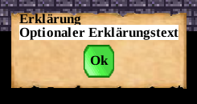

In diesem Verzeichnis finden Sie die Dokumentation für das 2022-Dungeon (Projekt `dungeon`).

## Was ist das (2022-)Dungeon?

Das Dungeon ist ein Tool, um klassische Übungsaufgaben als Quests in ein 2D-Rogue-Like Rollenspiel zu laden. Das Projekt richtet sich an Lehrende, die ihren Schüler*innen und Student*innen neue Möglichkeiten zum Lernen schaffen möchten. Mithilfe einer einfachen DSL können Lehrende ihre Aufgaben formulieren, und das Projekt erzeugt automatisch abwechslungsreiche Spielszenarien. Im Folgenden erfahren Sie, wie Sie Aufgaben definieren und in das Spiel laden können, und wie Sie das Spiel spielen, um die Aufgaben zu lösen.

## Starten des Dungeon-Systems und Laden einer Aufgabe

### Bauen der `Starter.jar`

1. Öffnen Sie die Kommandozeile
2. Navigieren Sie zum Hauptverzeichnis dieses Projekts
3. Führen Sie das Kommando `./gradlew starterJar` aus. Hierdurch wird die `Starter.jar` kompiliert, die zum Starten des Dungeons benötigt wird. Sie finden die `Starter.jar` nach dem kompilieren in `build/libs/`.

### Starten des Dungeon Systems

Führen Sie das Kommando `java -jar "build/libs/Starter.jar" --args "dungeon/doc/dsl/examplescripts/quickstart_example.dng"` aus.

Hierdurch wird die obenstehende `.dng`-Datei geladen. Der Dungeon öffnet sich in einem separaten Fenster und sollte in
etwa wie folgt aussehen:


Dieses Level dient dazu, eine Konfiguration aus der übergebenen `.dng`-Datei auszuwählen.

### Auswahl einer Konfiguration

Sie steuern den Zauberer  mit den Tasten W (hoch), A (links), S (runter), D (rechts).
Laufen Sie zu dem blauen Ritter  und drücken Sie die
Taste E zum Interagieren.
Es öffnet sich folgendes Auswahlfenster:


Unter "Lösung" werden alle Dungeon-Konfigurationen aufgelistet, die in der übergebenen
`.dng`-Datei gefunden werden. Wählen Sie "meine_config" per linkem Mausklick auf den
Kreis links daneben aus und klicken Sie anschließend auf "Bestätigen".

### Das generierte Spielszenario

In der Beispiel `.dng`-Datei ist nur eine einzige Single Choice Frage enthalten. Das
Standardszenario für eine Single Choice Frage entält zwei Räume. In dem ersten Raum
kann die Aufgabe bearbeitet werden:


Der zweite Raum entählt "Filler Content". Hierbei
handelt es sich um zufällig generierte spielerische Inhalte, die nicht zur Bearbeitung
einer Aufgabe nötig sind und lediglich einen spielerischen Anreiz bieten.


Die Räume sind durch Türen  miteinander verbunden. Durch das
Steuern des Spielcharakters auf eine Tür wird der Raum gewechselt.

### Bearbeiten der Aufgabe

Im Standardszenario für Single Choice Aufgaben wird die Frage über ein Auswahlmenü
gestellt. Steuern Sie hierfür die Spielfigur zum Ritter  und
interagieren Sie durch das Drücken der E-Taste mit ihm. Folgender Dialog öffnet sich:


Oben im Dialogfenster wird der Name der Aufgabe dargestellt ("meine_aufgabe"), der auch
in der `.dng`-Datei für die Aufgabendefinition verwendet wird.

Wählen Sie eine Antwort aus und klicken sie auf "Bestätigen" um die Antwort abzugeben oder
"Abbrechen", um das Auswahlmenü zu verlassen. Durch "Abbrechen" wird keine Antwort für
die Aufgabe abgegeben.

Wird die korrekte Antwort ausgewählt, erscheint folgender Dialog:


Durch Betätigung des "Ok"-Buttons wird der Dialog geschlossen.

Wird die falsche Antwort ausgewählt, erscheint folgender Dialog:


Anschließend wird ein optionaler Erklärungstext dargestellt, falls dieser in der
Aufgabendefinition angegeben ist. Hier ist ein Platzhalter angegeben:



Abschließend wird die eigentlich korrekte Antwort laut Aufgabendefinition dargestellt:


## Definition einer Aufgabe

Im folgenden Beispielcode wird die Definition einer Single Choice Frage dargestellt:

```
// datei: dungeon/doc/dsl/examplescripts/quickstart_example.dng

// Aufgabendefinition
single_choice_task meine_aufgabe {
    description: "Wie heißt die Hauptstadt von Schottland?",
    answers: [ "Glasgow", "Edinburgh", "Aberdeen" ],
    correct_answer_index: 1,
    explanation: "Optionaler Erklärungstext"
}

// Definition von Aufgabenabhängigkeiten
graph task_graph {
    meine_aufgabe;
}

// Übergabe der Aufgabenabhängigkeit an das Dungeon-System
dungeon_config meine_config {
    dependency_graph: task_graph
}
```

Mit der `single_choice_task`-Definition wird eine neue Aufgabe definiert.
`single_choice_task` ist dabei der Typ der Aufgabendefinition und legt fest, welche weiteren Informationen
konfiguriert werden müssen (für weitere Aufgabentypen: siehe [Dokumentation Aufgabenerstellung](dsl/task_definition.md)).
`meine_aufgabe` ist ein frei wählbarer Name für die Definition und dient dazu,
die Aufgabendefinition im weiteren Verlauf der `.dng`-Datei zu referenzieren.
Dabei werden der Aufgabentext (`description`), die möglichen Antworten (als Liste von Strings, `answers`)
und die korrekte Antwort als
Index in die `answers`-Liste (`correct_answer_index`) übergeben, diese Informationen sind zwingend
für Aufgabendefinition nötig. Es kann außerdem eine Erklärung (`explanation`) angegeben werden, welche
den Spielenden gezeigt wird, falls sie die Aufgabe falsch beantworten. Per `grading_function` wird
die Bewertungsfunktion angegeben, welche die Bewertung der Aufgabe umsetzt. Für jede Aufgabenart
ist eine default-Bewertungsfunktion vorhanden, die verwendet wird, falls keine Bewertungsfunktion
explizit in der Aufgabendefinition durch Nutzende konfiguriert wird.

Die einzelne Aufgabendefinition wird noch nicht vom Dungeon-System eingelesen. Um eine Aufgabendefinition
an das Dungeon-System zu übergeben, muss sie in einem Abhängigkeitsgraph (`graph`) referenziert werden.
In einem Abhängigkeitsgraph können mehrere Aufgaben miteinander in Abhängigkeit zueinander gesetzt werden
(siehe dafür [Dokumentation Aufgabenabhängigkeiten](control_mechanisms/petri_nets.md). Soll eine Aufgabe keine Abhängigkeiten zu anderen Aufgaben
haben, reicht es aus, sie einfach mit ihrem Namen in der `graph`-Definition zu referenzieren.

Der Abhängigkeitsgraph muss anschließend noch in einer `dungeon_config`-Definition referenziert werden.
Diesen Definitionen stellen den "Einstiegspunkt" für das Dungeon-System dar.

## Definition von Aufgabenabhängigkeiten

Das folgende Code-Snippet ist aus dem [quickstart_task_dependency.dng](dsl/examplescripts/quickstart_task_dependency.dng)
Beispielskript entnommen:

```
// datei: dungeon/doc/dsl/examplescripts/quickstart_task_dependency.dng

/*
 * Aufgabendefinitionen...
 */

// Definition von Aufgabenabhängigkeiten
graph task_graph {
    Aufgabe1 -> Aufgabe2 -> Aufgabe3 [type=sequence]
}

// Übergabe der Aufgabenabhängigkeit an das Dungeon-System
dungeon_config meine_config {
    dependency_graph: task_graph
}
```

Im genannten Skript werden drei Aufgaben definiert. Diese werden in der `graph`-Definition referenziert
und in Abhängigkeit zueinander gesetzt. Eine Aufgabenabhängigkeit wird durch die Verkettung der Aufgabenname
mit `->` erstellt. Außerdem muss der Typ der Abhängigkeiten definiert werden, hierfür wird das `type`-Attribut
verwendet. Die definierte Abhängigkeit lässt sich wie folgt lesen: `Aufgabe1` bildet eine Sequenz mit
`Aufgabe2` und `Aufgabe2` bildet eine Sequenz mit `Aufgabe3`. Hierdurch muss `Aufgabe1` zuerst bearbeitet werden,
danach muss `Aufgabe2` bearbeitet werden und abschließend `Aufgabe3`. Ob eine Aufgabe richtig oder falsch bearbeitet
wird spielt hierbei keine Rolle. Für eine Auflistung und Erklärung aller Abhängigkeitstypen siehe
[Dokumentation Aufgabenabhängigkeiten](control_mechanisms/petri_nets.md).

Das oben vorgestellte Skript kann wie unter [Starten des Dungeon Systems](#starten-des-dungeon-systems) beschrieben
gestartet werden.

## Wie geht es weiter?

Die Aufgabendefinitionen lassen noch mehr Konfigurationen zu, als in den Beispielskripten
verwendet wird. Für eine detaillierte Dokumentation der Aufgabendefinitionen, siehe [Dokumentation: Aufgabendefinition](dsl/task_definition.md).

Die bisher vorgestellten Aufgaben verwenden die Standard-Szenarien. Ein **Szenario**
beschreibt die Abbilung einer abstrakten Aufgabenbeschreibung in das Spiel.
Die DungeonDSL ermöglicht die Definition von eigenen Szenarien, siehe hierfür die
[Dokumentation für die Definition eigener Szenarien](dsl/scenario_builder.md).
