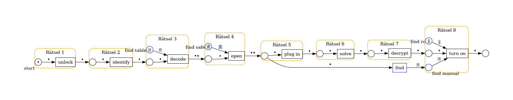
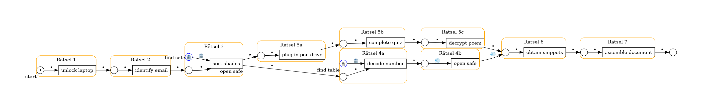

Der analoge Escape-Room basiert auf dem Cyber-Security-Briefing von Rian. Dabei folgen die Spieler Hinweisen, um ein geheimes Dokument zu finden, dass die Entführer des Urhebers verlangen. Es sind zwei Varianten geplant. Das Ziel ist die Auswirkung von Struktur und Mechaniken auf das Spielerlebnis zu evaluieren.

In beiden Varianten finden folgende Aktionen statt:

- ein nicht fachgerecht entsorgtes Passwort wird rekonstruiert
- eine echte Email wird zwischen Phishing-Mails erkannt
- ein geeigneter USB-Stick wird aus einer Menge von dreien identifiziert
- die Beantwortung eines Quizes

Ebenfalls beiden gemein sind folgende Mechaniken:

- eine binäre Zahl wird mittels einer Tabelle dekodiert
- ein Safe wird geöffnet
- ein Luftstrom wird benutzt um Hinweise offenzulegen
- eine CampusCard zum Öffnen des Raumes/des Schranks ist hinter dem Raumschild versteckt

Eingespielte Ansagen leiten die Spieler an und geben Hinweise.
Die werden zu Beginn angewiesen, nur mit elektrischen Geräten zu interagieren, wenn sie dazu aufgefordert wurden. Auf dem Laptop werden nur die geöffneten Programme verwendet. Es soll nichts über Augenhöhe angefasst werden.

# Variante 1 (J104)

Die Spieler werden vor der Tür des Raumes abgesetzt und müssen die CampusCard finden, um den Raum zu öffnen.
Nach dem Eintreten, wird ein Audioeintrag abgespielt.

Im Raum sind zwei Hälften eines zerissenen Notizzettels mit einem Passwort verteilt. Mit dem Passwort lässt sich ein Laptop entsperren, auf dem ein Mailprogramm geöffnet ist.
Zu sehen sind mehrere Emails, von denen alle bis auf eine Phishing-Emails sind. Die authentische Email enthält eine Zahlenfolge, die mithilfe einer im Raum versteckten Tabelle in das Dezimalsystem konvertiert wird. Die Ziffern bilden den Zugangscode für einen Safe, der als Buch getarnt im Raum steht.

Im Safe befindet sich eine Hinweis zur Verwendung der Klimaanlage und drei USB-Sticks. Zwei der USB-Sticks enthalten eine simulierte Malware-Warnung. Ein mit einem Hinweis auf das Passwort zum Laptop markierter USB-Stick enthält ein Quiz, dessen Lösung die Entschlüsselung eines Dokuments erlaubt. In dem Dokument fordert ein Text auf, schnell auf einen Link zu klicken. Allerdings führt der Link nirgendwo hin, sondern enthält ein Gedicht, dass mittels Mouseover sichtbar wird. Das Gedicht weist die Spieler zur Benutzung der Klimaanlage an.

Beim Aktivieren der Klimaanlage wird ein Zettel mit der Auflösung hervorgepustet und der Durchlauf ist zu ende.

# Variante 2 (J101)

Die Spieler betreten den Raum und es wird ein Audioeintrag abgespielt.
Das Rätsel zum Entsperren des Laptops und die Identifikation der Phishing-Mail sind wie in Variante 1.
Anders als in Variante 1 führt die richtige Email zu einem ersten Safe, der die USB-Sticks und eine CampusCard enthält.

Mit der CampusCard kann der Computerschrank geöffnet werden, der einen Staubsauger enthält.
Parallel dazu kann das Rätsel mit den USB-Sticks gelöst werden. Anders als in Variante 1 enthält der richtige USB-Stick einen Hinweis auf das Versteck des geheimen Dokuments.

Mit dem Staubsauger werden die Schnipsel aus einem Kabelkanal herausgesaugt. Die Spieler legen die Schnipsel zusammen um das Dokument zu rekonstruieren und der Durchlauf ist zu ende.
