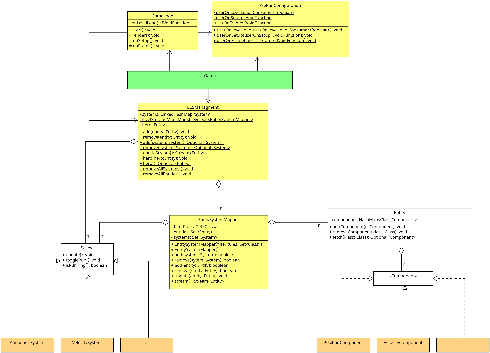

Dieses Dokument liefert einen Einstieg in das Dungeon. Es erläutert die Installation des Spiels und die ersten Schritte,
um eigene Inhalte zum Dungeon hinzuzufügen. Es dient als Grundlage für alle weiteren Praktika. Lesen Sie das Dokument
daher aufmerksam durch und versuchen Sie sich zusätzlich selbst mit dem Aufbau vertraut zu machen. Das Spiel befindet
sich im [Dungeon-Repo](https://github.com/Dungeon-CampusMinden/Dungeon) im Projekt
[`game`](https://github.com/Dungeon-CampusMinden/Dungeon/tree/master/game).

Sie benötigen nur dieses Projekt für die Aufgaben; die zusätzlichen Abhängigkeiten werden automatisch über Gradle
eingebunden.

*Hinweis:* Achten Sie darauf, Daten nur dann in öffentliche Git-Repos zu laden, wenn Sie die nötigen Rechte an diesen
Daten haben. Dies gilt insbesondere auch für Artefakte wie Bilder, Bitmaps, Musik oder Soundeffekte.

## Installation

Für das Dungeon wird das Java Development Kit 17.x.x (JDK 17) oder höher benötigt, stellen Sie sicher, dass Sie es
installiert haben.

Laden Sie das Projekt herunter und binden Sie es als Gradle-Projekt in Ihre IDE ein. Eine genauere
[Anleitung](../../doc/wiki/import-project.md) finden Sie in dem Projekt-Wiki.

Sie können über die run-Funktion Ihrer IDE überprüfen, ob die Installation lauffähig ist. Alternativ können Sie per
Konsole in das Dungeon-Root-Verzeichnis wechseln und `./gradlew run` ausführen. Es sollte sich das bereits
vorimplementierte Spiel starten.

*Hinweis:* Falls Sie Probleme beim Installieren haben, schauen Sie in die
[Kompatibilitätsliste](../../doc/wiki/jdk-Kompatibilitaet.md) und die [FAQ](../../doc/wiki/faq.md). Melden Sie sich
frühzeitig, falls Ihr Problem damit nicht behoben werden konnte.

## Grundlagen

Zu Beginn einige grundlegende Prinzipien, die Sie verstanden haben sollten, bevor Sie mit dem Dungeon arbeiten.

Das Dungeon benutzt das Cross-Plattform-Java-Framework [libGDX](https://libgdx.com) als Backend. Dieses ist im
Dungeon-Projekt bereits als Abhängigkeit in die Gradle-Konfiguration integriert, Sie müssen dieses nicht extra
installieren. Die Ihnen zur Verfügung gestellten Vorgaben sind so umgesetzt, dass Sie kein tieferes Verständnis für
libGDX benötigen, um die Aufgaben zu lösen. Sollten Sie allerdings einmal auf Probleme stoßen, kann es unter Umständen
helfen, einen Blick in die [Dokumentation von libGDX](https://libgdx.com/wiki/) zu werfen.

Das Dungeon-Projekt fungiert, ganz vereinfacht gesagt, als eine [Fassade](https://en.wikipedia.org/wiki/Facade_pattern)
zwischen libGDX und Ihrer eigenen Implementierung. Es implementiert ein [Entity-Component-System
(ECS)](https://en.wikipedia.org/wiki/Entity_component_system): - `Entity`: Entitites sind die Elemente (Helden, Monster,
Schatzkisten, etc.) des Spiels - `Component`: Components speichern die Datensätze der Entitäten (z.B. die
Lebenspunkte) - `System`: Systeme beinhalten die eigentliche Logik und agieren auf den Components.

Weiteres dazu erfahren Sie unter [ECS im Dungeon](ecs_basics.md).

Sie selbst nutzen und erweitern die `Component`s und `System`s der Vorgaben. Sie werden ebenfalls neue Entitäten,
Komponenten und Systeme konzipieren und implementieren. So erschaffen Sie z.B. Ihre eigenen Monster und fallengespickte
Level.

Sie werden im Laufe der Praktika verschiedene Assets benötigen. Diese liegen per Default im `assets`-Verzeichnis. Sie
können das Standardverzeichnis in der `build.gradle` anpassen.

-   Standardpfad für Texturen: `assets/`
-   Standardpfad für Charaktere: `assets/character/`
-   Standardpfad für Level-Texturen: `assets/textures/dungeon/`

## Wichtige Klassen im Dungeon

In diesem Abschnitt werden Ihnen die wichtigsten Klassen im Dungeon vorgestellt.



*Anmerkung:* Das UML ist für bessere Lesbarkeit auf die wesentlichen Bestandteile gekürzt.

Die in Grün markierte Klasse `Game` ist die zentrale API-Klasse für das Framework. Es liefert Ihnen Zugriff auf die in
Gelb markierten Klassen (Sie können über `Game` auf alle Schnittstellen der in Gelb markierten Klassen zugreifen). Die
Methode `GameLoop#render` ist die Gameloop.

Das ECS wird durch die in Weiß markierten Klassen `Entity`, `Component` und `System` gekennzeichnet.

Die Systeme iterieren über die im `ECSManagement` gespeicherten Entitäten und greifen über die Methode Entity#fetch auf
die benötigten Komponenten zu.

Die orangefarbenen `System`s und `Component`s sind im UML Beispiele für die bereits implementierten Systeme und
Komponenten.

Zusätzlich existieren noch eine Vielzahl an weiteren Hilfsklassen, mit denen Sie mal mehr oder mal weniger Kontakt haben
werden.

### Klasse *Game*

*Anmerkung*: Für die bessere Verständlichkeit sprechen wir im folgenden von der Klasse `Game` gemeint ist dabei die
Kombination der Klassen `PreRunConfiguration`,`ECSManagment` und `GameLoop`. Wie oben bereits beschrieben, können Sie
alle API-Methoden dieser Klassen über `Game` erreichen.

`Game` ist Ihr Einstiegspunkt in das Dungeon. Die Klasse erstellt die Entitäten, Components und Systeme des ECS und
beinhaltet die **Game-Loop**.

Die **Game-Loop** ist der wichtigste Bestandteil des Spieles. Sie ist eine Endlosschleife, welche einmal pro Frame
aufgerufen wird. Das Spiel läuft in 30 FPS (also 30 frames per seconds), die Game-Loop wird also 30-mal in der Sekunde
aufgerufen. Alle Aktionen, die wiederholt ausgeführt werden müssen, wie zum Beispiel das Bewegen und Zeichnen von
Figuren, müssen innerhalb der Game-Loop stattfinden.


*Hinweis:* Die Farbcodierung ist dieselbe wie beim UML-Klassendiagramm.

*Hinweis:* `GameLoop` erbt von `ScreenAdapter`, eine libGDX-Klasse, wo die Methode `render` vorgegeben wird, die
überschrieben wird. `render` wird von libGDX in jedem Frame aufgerufen. libGDX beinhaltet eine Loop, auf die wir keinen
Zugriff haben, weshalb wir `render` als unseren Game-Loop benutzen.

*Hinweis:* Die Game-Loop wird automatisch ausgeführt, Sie müssen sie nicht aktiv aufrufen.

`Game` implementiert noch weitere wichtige Methoden:

-   `setup()` wird zu Beginn der Anwendung aufgerufen. In dieser Methode werden die Objekte (wie die Systeme)
    initialisiert und konfiguriert, welche bereits vor dem Spielstart existieren müssen. In der Vorgabe wird hier
    bereits das erste Level geladen und die Systeme angelegt.
-   `userOnSetup(IVoidFucntion)` erlaubt Ihnen einen Callback hinterlegen, welcher wie `setup` zu Beginn des Spiels
    aufgerufen wird.
-   `frame()` wird in jedem Frame einmal aufgerufen.
-   `userOnFrame(IVoidFucntion)`erlaubt Ihnen einen Callback hinterlegen, welcher wie `frame` einmal pro Frame
    aufgerufen wird.
-   `onLevelLoad()` wird immer dann aufgerufen, wenn ein Level geladen wird. Hier werden später Entitäten erstellt, die
    initial im Level verteilt werden.
-   `userOnLevelLoad(Consumer<Boolean>)` erlaubt Ihnen eine eigene Callback-Methode hinterlegen. Der Boolean gibt an, ob
    das Level schon einmal geladen wurden.
-   `entitieStream()` liefert einen Stream aller `entitäten` zurück.
-   `add(Entity)` fügt neue Entitäten dem Spiel hinzu.
-   `remove(Entity)` entfernt die Entitäten aus dem Spiel.
-   `add(System)` fügt neue Systeme dem Spiel hinzu.
-   `remove(System)` entfernt das System aus dem Spiel.
-   `run()` startet das Spiel.

### Entity

Entitäten sind die Objekte im Spiel. Im Code sind sie nur leere Container, dessen Eigenschaften über die zugewiesenen
Components bestimmt werden. Entitäten haben neben den Components keine eigenen Attribute oder Funktionen.

Sie werden nicht durch Ableiten der Klasse `Entity` erzeugt (Ausnahme ist der Held, dazu später mehr). Stattdessen
werden sie durch Erzeugen einer Instanz von `Entity` und Hinzufügen von`Component`s implementiert.

Entitäten müssen mit `Game#add` im Spiel registriert werden.

### Component

Die `Component`s sind die Datensätze der Entitäten und beschreiben deren Eigenschaften. Eine Entität kann nur eine
Instanz eines Component-Typen speichern.

### System

Systeme agieren auf den Components und ändern die Werte in diesen. Sie bestimmen also das Verhalten der Entitäten. Ein
System kann auf mehrere Components agieren.

*Hinweis:* Um mehr darüber zu erfahren, wie Sie eigene Entitäten, Components und Systeme erstellen, werfen Sie einen
Blick in [Eigene Inhalte erstellen](create_own_content.md).

## Übung: Eigenen Helden erstellen

Zwar gibt es in den Vorlagen bereits einen Helden (den schauen wir uns am Ende dieses Kapitels genauer an), trotzdem
wird Ihnen hier erklärt, wie Sie Ihre erste eigene Entität in das Spiel implementieren.

### Eigene Main

Zu Beginn erstellen Sie sich eine eigene Main-Klasse mit Main-Methode. Diese können Sie im package `starter` ablegen. In
der `main` starten wir das Spiel mit `Game.run()`.

``` java
package starter;
import core.Game;

public class Main {
    public static void main(String[] args) {
        Game.run();
    }
}
```

Wenn Sie jetzt die Anwendung starten, sollten Sie das Level sehen. Aber von einem Helden fehlt noch jede Spur.

### Die Welt braucht einen Helden

Um unseren Helden anzulegen, müssen wir erst einmal festlegen, wann der Held erzeugt werden soll. In diesem Beispiel
legen wir den Helden zu Beginn des Spiels, in der `setup` Methode an (es wäre auch denkbar, den Helden in der
`onLevelLoad` Methode anzulegen). Um unseren eigenen Callback `userOnSetup` zu hinterlegen, erstellen wir eine neue
`IVoidFunction`.

*Anmerkung:* Das Erstellen der Entitäten in der `onSetup` Methode ist nur für den Helden möglich, andere Entitäten
müssen in der `onLevelLoad` Methode erstellt werden.

``` java
package starter;

import core.Game;
import core.utils.IVoidFunction;

public class Main {
    public static void main(String[] args) {
        IVoidFunction onSetup = new IVoidFunction() {
            @Override
            public void execute() {

            }
        };
        Game.userOnSetup(onSetup);
        Game.run();
    }
}
```

In der `execute`-Funktion der `IVoidFunction`, legen wir nun unseren Helden an.

*Hinweis:* In den [ECS-Basics](ecs_basics.md) können Sie mehr über die userspezifischen Callbacks lesen.

Ein Held ist eine Entität. Mit `Entity hero = new Entity()`, können wir eine neue Entität anlegen. Damit der Held im
Level platziert werden kann, braucht er ein `PositionComponent` und um vom Spiel gezeichnet werden zu können, ein
`DrawComponent`. Für das `DrawComponent` muss ein `SimplePath` übergeben werden, welcher angibt, in welchem
Asset-Verzeichnet die Texturen für unseren Helden liegen.

*Hinweis:* In [Animation](animation.md) können Sie mehr über Animationen und die benötigten Ordnerstrukturen lesen.

Damit die Kamera unseren Helden in den Fokus nimmt, geben wir ihm auch das `CameraComponent`. Zu guter Letzt markieren
wir ihn mit dem `PlayerComponent` als spielbaren Charakter.

Ach so, und natürlich müssen wir unseren Helden noch im Spiel mit `Game.add(hero)` registrieren.

``` java
package starter;

import core.Entity;
import core.Game;
import core.components.CameraComponent;
import core.components.DrawComponent;
import core.components.PlayerComponent;
import core.components.PositionComponent;
import core.utils.IVoidFunction;
import core.utils.components.path.SimpleIPath;

import java.io.IOException;

public class Main {
    public static void main(String[] args) {
        IVoidFunction onSetup =
                new IVoidFunction() {
                    @Override
                    public void execute() {
                        Entity hero = new Entity();
                        hero.add(new PositionComponent());
                        try {
                            hero.add(new DrawComponent(new SimpleIPath("character/knight")));
                        } catch (IOException e) {
                            System.out.println("Could not load textures for hero.");
                            throw new RuntimeException(e);
                        }
                        hero.add(new CameraComponent());
                        hero.add(new PlayerComponent());
                        Game.add(hero);
                    }
                };
        Game.userOnSetup(onSetup);
        Game.run();
    }
}
```

*Hinweis:* Wenn Sie mal ein `Component` einer Entität abfragen wollen, nutzen Sie die Methode `Entity#getComponent` und
übergeben Sie die `class` des gesuchten `Component`s. Beispiel: `hero.fetch(PositionComponent.class);`

### Held bewegen

Damit der Held vom `VelocitySystem` bewegt werden kann, benötigt er das `VelocityComponent`. Das `VelocityComponent`
speichert die Maximalgeschwindigkeit des Helden (in diesem Beispiel `5f` auf jeder Achse).

Damit wir den Helden auch per Tastatur steuern können, müssen im `PlayerComponent` noch die Tasten und das dazugehörige
Verhalten registriert werden.

Um die Konfiguration zu laden, können wir (außerhalb eines Callbacks)
`Game.loadConfig("dungeon_config.json",core.configuration.KeyboardConfig.class);` aufrufen. Die Methode prüft zuerst, ob
das File "dungeon_config.json" vorhanden ist und wenn ja, lädt die dort gespeicherte Tastenbelegung, ansonsten wird die
Konfiguration aus der Klasse `core.configuration.KeyboardConfig.class` geladen.

*Hinweis*: Hier erfahren Sie mehr zur Konfiguration der [Tastenbelegung](configuration/readme.md).

Jetzt müssen die Tastatureingaben noch im Helden hinterlegt werden. Dies wird über das `PlayerComponent` gemacht.

``` java
PlayerComponent pc = new PlayerComponent();
pc.registerCallback(core.configuration.KeyboardConfig.MOVEMENT_UP.value(),
    entity -> {
        VelocityComponent vc =
            entity.fetch(VelocityComponent.class).orElseThrow(
            () -> MissingComponentException.build(entity,VelocityComponent.class));
        vc.currentYVelocity(vc.yVelocity());
    });
```

Mit `PlayerComponent#registerCallback` können wir einen Evenhandler für eine Tastatureingabe registrieren. Der erste
Parameter (hier `core.configuration.KeyboardConfig.MOVEMENT_UP.value()`) gibt an, bei welchen Tastendruck das Event
ausgelöst werden soll. Der zweite Parameter ist ein `Comsumer<Entity>` welcher (mit dem Helden als Parameter) aufgerufen
wird, wenn das Event ausgelöst wird. In diesem Callback fetchen wir uns nun das `VelocityComponent` aus dem Helden und
setzen mit `VelocityComponent#currentYVelocity` die aktuelle Geschwindigkeit auf der Y-Achse auf den vorher
konfigurierten Wert. Der Held kann sich jetzt nach oben bewegen.

Unsere Finale Main sollte nun so aussehen:

``` java
package starter;

import core.Entity;
import core.Game;
import core.components.*;
import core.utils.IVoidFunction;
import core.utils.components.MissingComponentException;
import core.utils.components.path.SimpleIPath;

import java.io.IOException;

public class Main {
    public static void main(String[] args) throws IOException {
        IVoidFunction onSetup =
                new IVoidFunction() {
                    @Override
                    public void execute() {
                        Entity hero = new Entity();
                        hero.add(new PositionComponent());
                        try {
                            hero.add(new DrawComponent(new SimpleIPath("character/knight")));
                        } catch (IOException e) {
                            System.out.println("Could not load textures for hero.");
                            throw new RuntimeException(e);
                        }
                        hero.add(new CameraComponent());
                        hero.add(new VelocityComponent(5f, 5f));
                        PlayerComponent pc = new PlayerComponent();
                        pc.registerCallback(
                                core.configuration.KeyboardConfig.MOVEMENT_UP.value(),
                                entity -> {
                                    VelocityComponent vc =
                                            entity.fetch(VelocityComponent.class)
                                                    .orElseThrow(
                                                            () ->
                                                                    MissingComponentException.build(
                                                                            entity,
                                                                            VelocityComponent
                                                                                    .class));
                                    vc.currentYVelocity(vc.yVelocity());
                                });
                        hero.add(pc);
                        Game.add(hero);
                    }
                };
        Game.userOnSetup(onSetup);
        Game.loadConfig(new SimplePath("dungeon_config.json"), core.configuration.KeyboardConfig.class);
        Game.run();
    }
}
```

Implementieren Sie nun selbst die Steuerung für die anderen Bewegungen.

*Anmerkung*: Oben ist der Consumer-Parameter als lambda Ausdruck formuliert, eine alternative Schreibweise wäre

``` java
pc.registerCallback(
    core.configuration.KeyboardConfig.MOVEMENT_UP.value(),
    new Consumer<Entity>() {
        @Override
        public void accept(Entity entity) {
            VelocityComponent vc =entity.fetch(VelocityComponent.class)
                .orElseThrow(() ->MissingComponentException.build(entity,VelocityComponent.class));
            vc.currentYVelocity(vc.yVelocity());
        }
    });
```

## Linksammlung

Hier finden Sie noch einige Links, um Ihr Verständnis des Dungeons zu vertiefen:

-   [ECS Basics](ecs_basics.md)
-   [Entitäten, Components und Systeme selbst erstellen](create_own_content.md)
-   [Config](configuration/readme.md)
-   [Dungeon-Wiki](../../doc/wiki)
-   [LibGDX Dokumentation](https://libgdx.com/wiki/)
