Nach einem Escape-Room kann das Spiel jedem Spieler eine kurze Umfrage zeigen. Die Fragen stehen in
einer JSON-Datei pro Raum. Dieses Dokument beschreibt, welche Fragetypen es gibt und wie man sie
aufschreibt. Programmieren muss man dafür nicht.

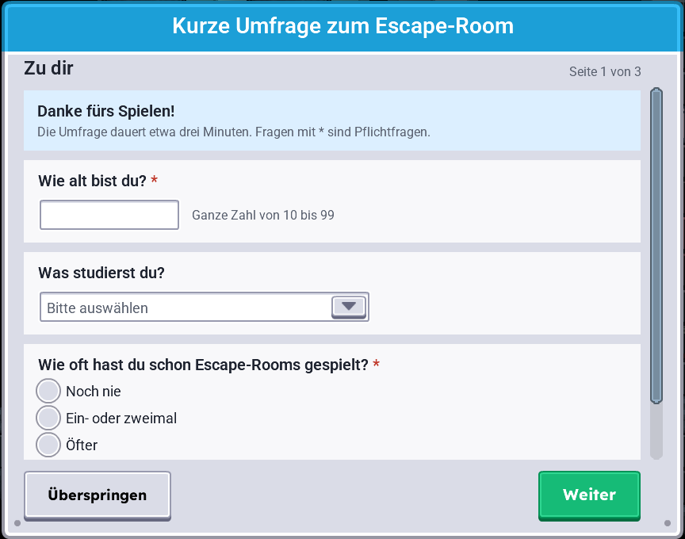

## Wo die Datei liegt

Die Datei heißt `game/assets/surveys/<roomId>.json`. `<roomId>` ist die Raum-ID, unter der der Raum
getrackt wird, zum Beispiel `system-recovery` oder `soulweaver`. Gibt es die Datei nicht, zeigt der
Raum keine Umfrage. Ist sie fehlerhaft, entfällt die Umfrage ebenfalls und das Log nennt den Fehler.

Die Umfrage erscheint nach dem Raumergebnis und vor dem Abspann. Jeder Spieler beantwortet sie für
sich. Ohne Tracking-Zustimmung erscheint sie nicht, weil die Antworten dann nicht gespeichert werden
dürfen.

## Grundgerüst

```json
{
  "schemaVersion": 1,
  "roomId": "system-recovery",
  "questionnaireId": "escape-room-feedback-v1",
  "title": { "de": "Kurze Umfrage zum Escape-Room", "en": "Short survey about the escape room" },
  "skippable": true,
  "pages": [
    {
      "title": { "de": "Zu dir", "en": "About you" },
      "questions": [ ]
    }
  ]
}
```

| Feld | Bedeutung |
| --- | --- |
| `schemaVersion` | Immer `1`. |
| `roomId` | Muss dem Dateinamen entsprechen. |
| `questionnaireId` | Kennung des Fragebogens; sie wird mit jeder Antwort gespeichert. Ändern sich Fragen so, dass alte und neue Antworten nicht mehr vergleichbar sind, bekommt der Fragebogen eine neue Kennung, etwa `-v2`. |
| `title` | Überschrift im blauen Kopf des Dialogs. |
| `skippable` | `true` zeigt einen Knopf „Überspringen“ mit Rückfrage, `false` verlangt das Absenden. |
| `pages` | Seiten in Anzeigereihenfolge. Jede Seite hat optional einen `title` und mindestens eine Frage. Die Spieler blättern mit „Weiter“ und „Zurück“. |

### Texte und Sprachen

Jeder angezeigte Text ist ein Objekt mit `de` und/oder `en`, wie bei den Credits. Fehlt die
Spielsprache, zeigt das Spiel `de`, danach `en`. Eine rein deutsche Umfrage braucht also nur `de`.

### Kennungen

`id`-Werte bestehen aus Buchstaben, Ziffern, `_` und `-`. Frage-IDs sind in der ganzen Datei
eindeutig, Options-IDs innerhalb ihrer Frage. `other` ist für „Sonstiges“ reserviert. In der
Auswertung erscheinen nur die IDs, nicht die angezeigten Texte; wähle sie deshalb sprechend und
ändere sie nicht mehr, sobald Daten erhoben werden.

### Felder jeder Frage

| Feld | Pflicht | Bedeutung |
| --- | --- | --- |
| `id` | ja | Kennung der Frage. |
| `type` | ja | Einer der Typen unten. |
| `text` | ja | Fragetext. |
| `description` | nein | Hilfetext in Grau unter der Frage. |
| `required` | nein | `true` macht die Frage zur Pflichtfrage, sichtbar am roten `*`. Standard ist `false`. |

Unbekannte Felder gelten als Fehler, damit sich Tippfehler wie `"requierd"` nicht still einschleichen.

## Fragetypen

### Info-Block: `info`

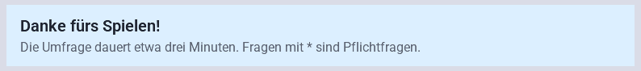

Text ohne Eingabe, etwa eine Begrüßung, ein Hinweis zur Dauer oder zum Datenschutz. `text` ist die
fett gedruckte erste Zeile, `description` der Fließtext darunter. `required` gibt es hier nicht.

```json
{ "id": "intro", "type": "info",
  "text": { "de": "Danke fürs Spielen!" },
  "description": { "de": "Die Umfrage dauert etwa drei Minuten. Fragen mit * sind Pflichtfragen." } }
```

### Kurzer Text: `shortText`

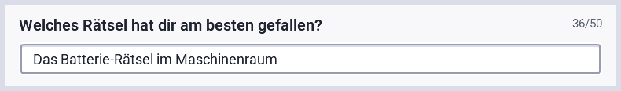

Einzeiliges Textfeld für kurze Antworten wie einen Namen oder ein Stichwort.

| Feld | Bedeutung |
| --- | --- |
| `maxLength` | Höchstzahl an Zeichen, Standard 50. Rechts neben der Frage zählt das Spiel mit, etwa `12/50`. |

```json
{ "id": "favorite-puzzle", "type": "shortText",
  "text": { "de": "Welches Rätsel hat dir am besten gefallen?" } }
```

Gespeichert wird der Text, zum Beispiel `"Das Batterie-Rätsel"`.

### Langer Text: `longText`

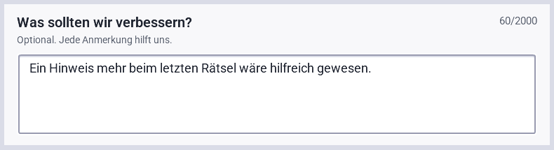

Mehrzeiliges Feld für freie Rückmeldungen. Zeilenumbrüche bleiben erhalten.

| Feld | Bedeutung |
| --- | --- |
| `maxLength` | Optionale Höchstzahl an Zeichen mit Zähler wie beim kurzen Text. Ohne Angabe ist die Länge unbegrenzt. |

```json
{ "id": "improvements", "type": "longText", "maxLength": 2000,
  "text": { "de": "Was sollten wir verbessern?" },
  "description": { "de": "Optional. Jede Anmerkung hilft uns." } }
```

### Zahl: `number`

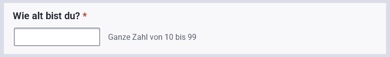

Zahlenfeld, zum Beispiel für das Alter. Rechts daneben erklärt das Spiel den erlaubten Bereich.
Buchstaben lassen sich nicht eingeben. Ein Minus lässt sich nur tippen, wenn `min` fehlt oder negativ
ist; Komma und Punkt nur mit `decimals: true`, beide als Dezimaltrennzeichen.

| Feld | Bedeutung |
| --- | --- |
| `min`, `max` | Optionaler kleinster und größter erlaubter Wert. |
| `decimals` | `true` erlaubt Kommazahlen, Standard ist `false` (nur ganze Zahlen). |

```json
{ "id": "age", "type": "number", "required": true, "min": 10, "max": 99,
  "text": { "de": "Wie alt bist du?" } }
```

Gespeichert wird die Zahl, zum Beispiel `24`.

### Skala: `scale`

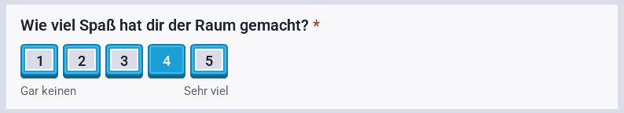

Eine Reihe von Zahlenknöpfen, etwa von 1 bis 5. Die optionalen Beschriftungen der beiden Enden
stehen unter dem ersten und dem letzten Knopf. Ein zweiter Klick auf den gewählten Wert hebt die
Auswahl wieder auf. Geeignet für Bewertungen wie „Wie viel Spaß hat dir der Raum gemacht?“.

| Feld | Bedeutung |
| --- | --- |
| `min`, `max` | Kleinster und größter Wert, Standard 1 und 5. Höchstens elf Werte, `min` ab 0. |
| `minLabel`, `maxLabel` | Optionale Beschriftung der beiden Enden. |

```json
{ "id": "fun", "type": "scale", "required": true, "min": 1, "max": 5,
  "text": { "de": "Wie viel Spaß hat dir der Raum gemacht?" },
  "minLabel": { "de": "Gar keinen" }, "maxLabel": { "de": "Sehr viel" } }
```

Gespeichert wird der gewählte Wert, zum Beispiel `4`.

### Einfachauswahl: `singleChoice`

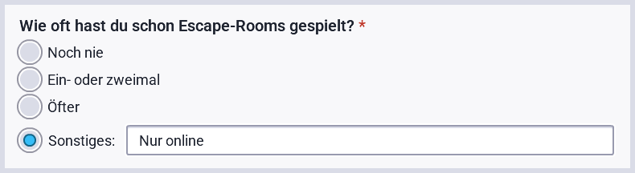

Runde Auswahlknöpfe, von denen genau einer gewählt werden kann. Mit `"other": true` erscheint
zusätzlich „Sonstiges“ mit einem Textfeld. Wer dort tippt, wählt „Sonstiges“ automatisch aus; wer
„Sonstiges“ ohne Text wählt, bekommt einen Hinweis.

| Feld | Bedeutung |
| --- | --- |
| `options` | Liste aus `{ "id": "...", "text": { ... } }`. |
| `other` | `true` ergänzt „Sonstiges“ mit Freitext. |

```json
{ "id": "escape-room-experience", "type": "singleChoice", "required": true, "other": true,
  "text": { "de": "Wie oft hast du schon Escape-Rooms gespielt?" },
  "options": [
    { "id": "never", "text": { "de": "Noch nie" } },
    { "id": "once", "text": { "de": "Ein- oder zweimal" } },
    { "id": "often", "text": { "de": "Öfter" } } ] }
```

Gespeichert wird `{"selected": "once"}` oder bei Sonstiges
`{"selected": "other", "otherText": "Nur am PC"}`.

### Mehrfachauswahl: `multiChoice`

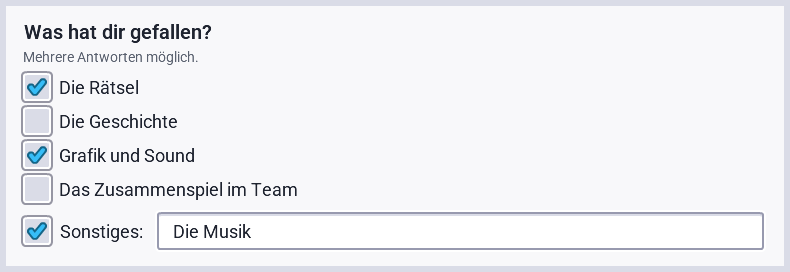

Eckige Kontrollkästchen; beliebig viele Optionen sind wählbar. Bei einer Pflichtfrage muss
mindestens eine gewählt sein. `options` und `other` funktionieren wie bei der Einfachauswahl.

```json
{ "id": "liked", "type": "multiChoice", "other": true,
  "text": { "de": "Was hat dir gefallen?" },
  "description": { "de": "Mehrere Antworten möglich." },
  "options": [
    { "id": "puzzles", "text": { "de": "Die Rätsel" } },
    { "id": "story", "text": { "de": "Die Geschichte" } } ] }
```

Gespeichert wird `{"selected": ["puzzles", "other"], "otherText": "Die Musik"}`.

### Auswahlliste: `dropdown`

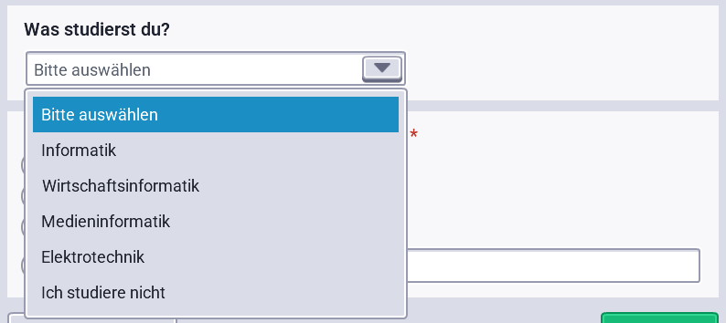

Eine aufklappbare Liste mit einer Auswahl. Sie spart Platz bei vielen Optionen, etwa für
Studiengänge. „Sonstiges“ gibt es hier nicht; nimm dafür eine eigene Option oder eine
Einfachauswahl.

```json
{ "id": "study-program", "type": "dropdown",
  "text": { "de": "Was studierst du?" },
  "options": [
    { "id": "computer-science", "text": { "de": "Informatik" } },
    { "id": "none", "text": { "de": "Ich studiere nicht" } } ] }
```

Gespeichert wird `{"selected": "computer-science"}`.

### Matrix: `matrix`

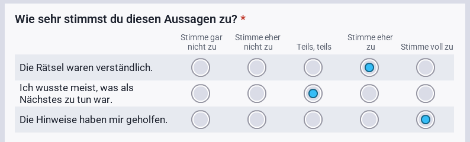

Mehrere Aussagen, die alle auf denselben Spalten bewertet werden, etwa eine Likert-Skala von
„Stimme gar nicht zu“ bis „Stimme voll zu“. In jeder Zeile ist eine Antwort wählbar. Eine
Pflicht-Matrix verlangt eine Antwort in jeder Zeile.

| Feld | Bedeutung |
| --- | --- |
| `rows` | Die Aussagen, Liste aus `{ "id": "...", "text": { ... } }`. |
| `columns` | Die Antwortspalten, mindestens zwei, gleiche Form. |

```json
{ "id": "statements", "type": "matrix", "required": true,
  "text": { "de": "Wie sehr stimmst du diesen Aussagen zu?" },
  "rows": [
    { "id": "puzzles-clear", "text": { "de": "Die Rätsel waren verständlich." } },
    { "id": "hints-helpful", "text": { "de": "Die Hinweise haben mir geholfen." } } ],
  "columns": [
    { "id": "1", "text": { "de": "Stimme gar nicht zu" } },
    { "id": "2", "text": { "de": "Stimme eher nicht zu" } },
    { "id": "3", "text": { "de": "Teils, teils" } },
    { "id": "4", "text": { "de": "Stimme eher zu" } },
    { "id": "5", "text": { "de": "Stimme voll zu" } } ] }
```

Gespeichert wird je Zeile die Spalten-ID: `{"puzzles-clear": "4", "hints-helpful": "5"}`.

## Pflichtfragen und Prüfung

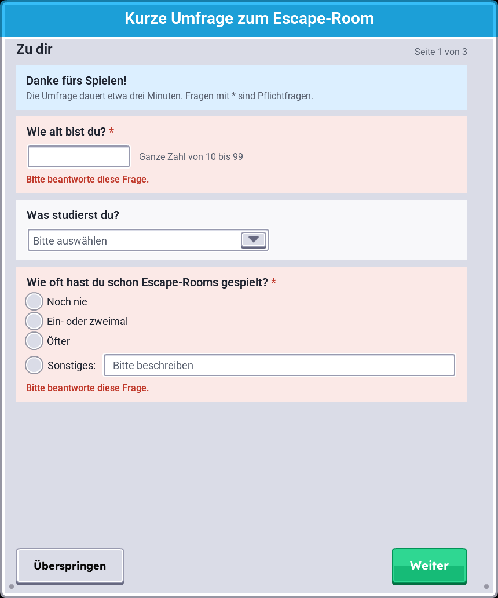

„Weiter“ und „Absenden“ prüfen die aktuelle Seite. Fehlt eine Pflichtantwort oder passt eine Zahl
nicht in den Bereich, färbt sich die Frage rot, darunter steht der Grund und die Seite scrollt zur
ersten betroffenen Frage. Bei einer Matrix sind zusätzlich die unbeantworteten Zeilen markiert. Ab
dann prüft das Spiel die Frage bei jeder Änderung; ist sie richtig beantwortet, wird sie wieder
neutral.

## Überspringen

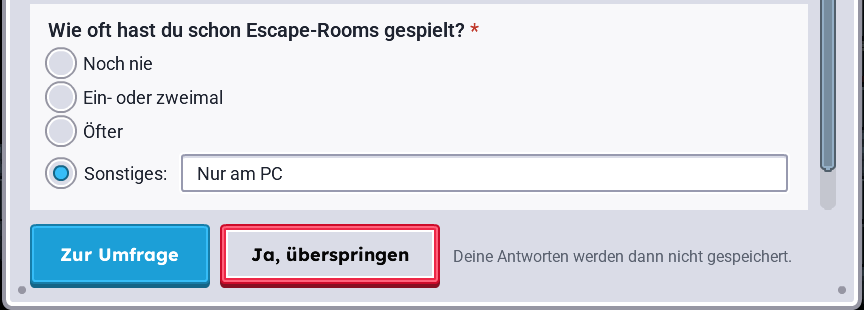

Mit `"skippable": true` gibt es links unten „Überspringen“. Ein Klick ersetzt die Knöpfe durch „Zur
Umfrage“ und „Ja, überspringen“; erst die Bestätigung beendet die Umfrage. Bis dahin eingegebene
Antworten werden dabei nicht gespeichert.

## Nach dem Absenden

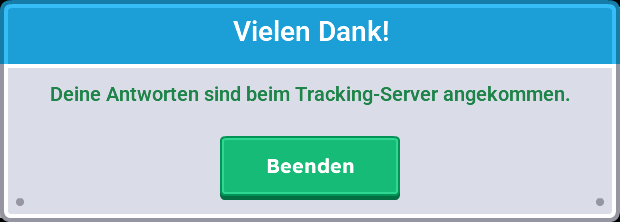

Nach dem Absenden zeigt das Spiel, wo die Antworten gelandet sind: beim Tracking-Server
angekommen, nur auf diesem Rechner gespeichert, noch nicht bestätigt (sie werden später
nachgereicht) oder nicht gespeichert.

Für die Auswertung wird jede beantwortete Frage als eigenes Tracking-Ereignis `SURVEY_ANSWERED` mit
`questionnaireId`, `questionId` und `answer` gespeichert. Es gehört zur Sitzung des Raums und zur
sitzungsgebundenen Teilnehmer-ID des Spielers. Unbeantwortete optionale Fragen erzeugen kein
Ereignis. Freitext kann personenbezogene Daten enthalten; frage deshalb nicht nach Namen oder
Kontaktdaten.
