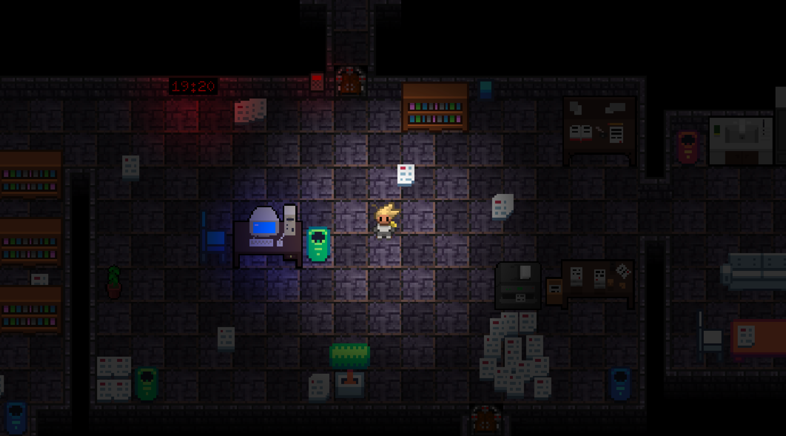

# The Last Hour (Escape Room Demo)

* Die Demo befindet sich aktuell in Entwicklung.*

Dieses Subprojekt soll als Demo für ein DEER mit Cybersecurity Theme dienen und setzt dabei die [Beschriebenen](https://github.com/Dungeon-CampusMinden/Dungeon/discussions/2607) Rätsel um. 

Eandelt sich um ein etwa 10-minütiges, geführtes Dungeon-Erlebnis für ein bis drei Spielende, das zeigt, wie sich Storytelling, Rätselmechaniken, Zusammenarbeit und Learning Analytics in einem DEER verbinden lassen.

Die Handlung spielt in einer verlassenen unterirdischen Forschungseinrichtung, in der ein Wissenschaftler verschwunden ist. Ziel der Spielenden ist es, gestörte Systeme zu stabilisieren und vertrauliche Forschungsdaten zu sichern. Dabei werden praxisnahe Kompetenzen zur IT-Sicherheits- und Cybersecurity-Awareness trainiert, u. a.:
* Informationen aus verschiedenen Quellen bewerten,
* echte von manipulierten digitalen Nachrichten unterscheiden,
* sichere Datenhandhabung anwenden (z. B. Passwörter, Umgang mit sensiblen Daten),
* unter Zeitdruck gemeinsam schlussfolgern,
* Hinweise und Wiederherstellungsoptionen sinnvoll nutzen.

Die Spielwelt enthält interaktive Objekte wie Terminals mit Authentifizierung, Dokumente mit Teilhinweisen, verschlossene Speicher und simulierte digitale Schnittstellen. Daraus entstehen miteinander verknüpfte Rätsel, die gelöst werden müssen, um voranzukommen.

Hervorgehoben werden drei zentrale Designprinzipien des Toolkits:

1. **Narrative Einbettung** der Rätsel in eine zusammenhängende Geschichte,
2. **Authentische Interaktionen**, die reale Sicherheitspraktiken abbilden,
3. **Adaptiver Support** durch optionale Hinweise und Fehlerkorrekturen ohne Spielabbruch.
