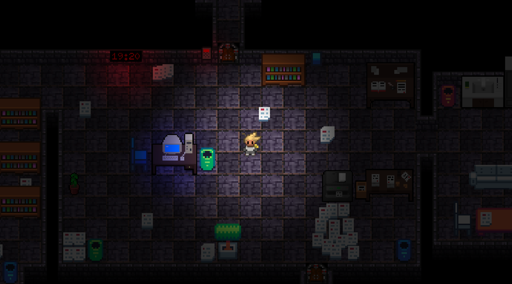

# The Last Hour (Escape Room Demo)

A scientist has vanished: You have 20 minutes to find out why. **The Last Hour** is a cybersecurity Digital Educational Escape Room (DEER) for 1-2 players that drops you into a web of interconnected puzzles. Can you investigate, crack the codes, and escape before time runs out?

## Requirements

The Last Hour runs on Windows, Mac, and Unix systems. Mobile devices are not currently supported.

The game requires [Java SE Development Kit 21 LTS](https://jdk.java.net/21/) to be installed.

## How to Play (Singleplayer)

* Download [TheLastHour.jar](https://github.com/Dungeon-CampusMinden/Dungeon/releases)
* Start the game by double-clicking the downloaded JAR file
* If the JAR doesn't launch, make sure Java 21 is installed and open a terminal:
  * Verify your Java installation with `java --version`
  * Start the game with `java -jar /PATH/TO/JAR/TheLastHour.jar` (replace the path with the actual location of the downloaded JAR)

## How to Play (Multiplayer)

*Note: Since this is a work-in-progress project, the multiplayer setup is not yet user-friendly. We recommend non-technical users play the singleplayer mode.*

*Note: Multiplayer does not currently support play over the internet — make sure both devices are on the same local network.*

Multiplayer requires two separate devices; local co-op on a single device is not yet supported.

1. Download the source code (or clone the repository) from GitHub on both devices
2. On the **host device**, start the game with Gradle:
   * Run `./gradlew runTheLastHourServer` in one terminal and `./gradlew runTheLastHourClient` in a second terminal
3. On the **client device**, open `theLastHourEscapeRoom/src/starter/LastHourClient` in a text editor of your choice
4. Change the IP address in `PreRunConfiguration.networkServerAddress("127.0.0.1");` to the IP address of the host device. You can verify connectivity with a `ping`
5. Also change `PreRunConfiguration.username("Player1");` to `PreRunConfiguration.username("Player2");`
6. Start the game on the client with `./gradlew runTheLastHourClient`
